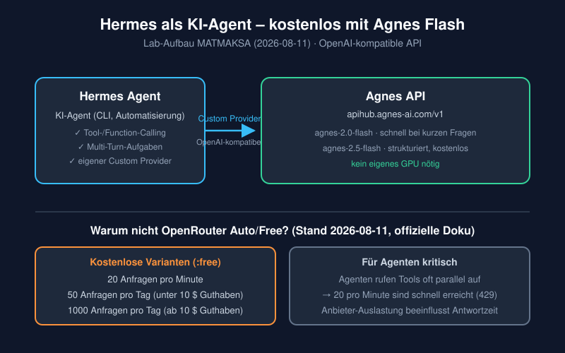

+++
title = "Hermes als KI-Agent mit dem kostenlosen Agnes 2.5 Flash betreiben – und warum OpenRouter Auto/Free nicht die bessere Wahl ist"
description = "So richtest du Hermes mit dem kostenlosen Agnes 2.5 Flash als KI-Agent ein – inklusive Tool-Calling. Und warum OpenRouter Auto/Free wegen Rate Limits und Zuverlässigkeit für Agenten schlecht geeignet ist."
date = 2026-08-11
draft = false
robotsNoIndex = true
noindex = true
preview = true
draft_banner = true
hideMeta = true
ShowShareButtons = false
ShowPostNavLinks = false
comments = false
tags = ["hermes", "ki-agent", "agnes", "openrouter", "homelab", "kostenlos"]
categories = ["Software"]

[sitemap]
  exclude = true

# Preview Classification
preview_content_type = "article_draft"
publish_eligible = false
user_visual_approval_required = true
fact_check_required = true
link_check_required = true
price_check_required = false
recommended_action = "Labdaten und OpenRouter-Limits vor einer Veröffentlichung erneut gegen aktuelle Primärquellen prüfen; Diagramm und Text visuell vom Eigentümer freigeben lassen."
content_intent = "pillar"
monetization_intent = "none"
affiliate_disclosure_required = false
price_research_required = false
product_recommendation_allowed = false
instagram_derivatives_required = false
risk_level = "medium"
content_state = "draft_generated"
audit_status = "not_started"
user_approval_required = true
approved_for_publish = false
next_action = "technical_factcheck_and_owner_review_before_publish"

[workflow]
  content_state = "draft_generated"
  editorial_status = "open"
  technical_status = "open"
  visual_status = "open"
  seo_status = "open"

# Bild-Manifest
images = [{ file = "hermes-agnes-openrouter-architektur.svg", type = "diagram", source = "MATMAKSA", author = "MATMAKSA", license = "own", source_url = "", license_url = "", retrieved_at = "", modified = false, alt = "Architekturdiagramm: Hermes Agent nutzt über einen Custom Provider die Agnes-API; rechts die OpenRouter-Free-Limits.", caption = "Lab-Aufbau: Hermes → Custom Provider → Agnes API (OpenAI-kompatibel).", secrets_reviewed = true, public_approved = false }]
+++

> **Preview – noch nicht veröffentlicht.** Dieser Entwurf beruht auf dem MATMAKSA-Labtest vom 2026-08-11. Er enthält keine Zugangsdaten, keine internen Adressen und keine Gerätepreise. Vor einer Veröffentlichung müssen die OpenRouter-Limits erneut gegen die offizielle Doku geprüft und die Freigabe des Eigentümers eingeholt werden.

# Hermes als KI-Agent mit dem kostenlosen Agnes 2.5 Flash betreiben – und warum OpenRouter Auto/Free nicht die bessere Wahl ist

## Kurzantwort

Ja, du kannst **Hermes als KI-Agent mit dem kostenlosen Agnes-2.5-Flash-Modell** betreiben. Der Labtest vom 11. August 2026 im MATMAKSA-Homelab zeigt: Die Anbindung über einen eigenen API-Anbieter (Custom Provider) funktioniert, und auch **Tool-Aufrufe (Function Calling)** laufen – das ist die Grundlage für echte Agentenarbeit.

**OpenRouter Auto/Free ist dafür die schlechtere Wahl.** Die kostenlosen Modellvarianten von OpenRouter sind hart begrenzt: **20 Anfragen pro Minute** und – je nach bisher gekauftem Guthaben – **50 oder 1000 Anfragen pro Tag**. Ein Agent, der mehrere Werkzeuge nacheinander oder parallel aufruft, stößt damit schnell an die Grenze. Hinzu kommt: Die Antwortzeit hängt stark von der Auslastung der jeweiligen Anbieter ab.

| | |
|---|---|
| **⏱ Zeit** | 20–40 Minuten inklusive Test |
| **💰 Kosten** | 0 € (kostenloses Agnes-Flash-Modell) |
| **📊 Schwierigkeit** | ⭐⭐☆☆☆ |
| **🖥️ Benötigt** | Hermes-Installation, Agnes-API-Schlüssel, ein Testsystem |
| **🎯 Ziel** | Hermes als KI-Agent mit kostenlosem Agnes 2.5 Flash betreiben |
| **✅ Getestet** | 2026-08-11 im MATMAKSA-Lab (PVE04-Testhost, Hermes v0.20.0, Agnes-API) |



## 1. Die Begriffe kurz erklärt

- **KI-Agent:** Ein Programm, das eine Aufgabe nicht nur beantwortet, sondern eigenständig in Schritten bearbeitet – zum Beispiel Dateien liest, Befehle ausführt oder Webseiten abruft. Dafür braucht es **Tool-Aufrufe**: Das Modell entscheidet, welches Werkzeug mit welchen Argumenten aufgerufen werden soll.
- **Hermes:** Ein Agent-Framework, das genau diese Tool-Aufrufe verwaltet. Du gibst ein Ziel vor, Hermes plant und führt die Schritte aus.
- **Agnes:** Ein API-Anbieter mit **OpenAI-kompatibler Schnittstelle**. Das bedeutet: Clients, die OpenAI-Schnittstellen sprechen, können auch Agnes-Modelle ansprechen – nur mit anderer Adresse und anderem Schlüssel.
- **OpenRouter:** Ein Vermittler, der viele Modelle verschiedener Anbieter über eine einzige API anbietet – inklusive kostenloser Varianten (Modellnamen enden auf `:free`) und des automatischen Modells `openrouter/auto`.

## 2. Warum OpenRouter Auto/Free für einen Agenten ungünstig ist

Die Idee klingt verlockend: OpenRouter bündelt viele Modelle, und `openrouter/auto` wählt pro Anfrage selbst das „beste" verfügbare Modell aus. Für einen Agenten gibt es dafür zwei ernste Haken: **Rate Limits** und **Zuverlässigkeit**.

### Rate Limits der kostenlosen Varianten (Stand 11. August 2026)

Laut der offiziellen OpenRouter-Dokumentation gelten für Modellvarianten mit `:free` am Ende des Namens diese Grenzen:

| Bisher gekauftes Guthaben (gesamt) | Anfragen pro Minute | Anfragen pro Tag |
|---|---|---|
| Weniger als 10 US-Dollar | 20 | 50 |
| Mindestens 10 US-Dollar | 20 | 1000 |

Dazu kommen zwei wichtige Details aus derselben Quelle:

- **Neue Konten oder Schlüssel helfen nicht.** OpenRouter begrenzt die Kapazität global; zusätzliche API-Keys ändern an deinem Limit nichts.
- **DDoS-Schutz:** Cloudflare blockt Anfragen, die „dramatisch" über ein vernünftiges Maß hinausgehen.

### Was das für einen Agenten bedeutet

Ein Agent ist kein Chat, der einmal antwortet. Typische Agenten-Aufgaben erzeugen **viele Anfragen in kurzer Zeit**: Erst liest das Modell eine Datei, dann ruft es ein Tool auf, dann verarbeitet es das Ergebnis, dann ruft es das nächste Tool auf. Bei parallelen Tool-Aufrufen können schnell mehrere Anfragen pro Minute zusammenkommen.

- **20 Anfragen pro Minute** klingen viel, sind aber bei einer verschachtelten Aufgabe schnell erreicht – besonders wenn ein Agent denselben Schritt wiederholen oder korrigieren muss.
- **50 Anfragen pro Tag** reichen für eine kurze Testsitzung. Für regelmäßige Automatisierung (etwa ein Cron-Job, der morgens Berichte erstellt) ist das zu knapp.
- Bei Überschreitung antwortet OpenRouter mit **HTTP 429** und dem Hinweis, die Anfragen zu drosseln. Für einen unbeaufsichtigten Agenten bedeutet das: Wartezeiten, abgebrochene Abläufe oder aufwendige Retry-Logik.

### Zuverlässigkeit

Die kostenlosen Varianten hängen an der **Auslastung der jeweiligen Anbieter**. OpenRouter selbst schreibt in der Doku: Der Fehler 429 kann auch vom vorgelagerten Anbieter kommen, wenn dieser gerade ausgelastet ist. Es gibt zwar ein automatisches Fallback-Routing auf andere Anbieter, aber bei stark nachgefragten kostenlosen Modellen ist die Verfügbarkeit nicht garantiert.

Zusätzlich: Sobald das Kontoguthaben negativ ist, liefert OpenRouter **HTTP 402 – auch für kostenlose Modelle**. Und `openrouter/auto` wechselt unter Umständen zwischen verschiedenen Modellen – für einen Agenten, der reproduzierbare Ergebnisse und stabiles Verhalten braucht, ist das schwerer zu kontrollieren und zu debuggen.

**Kurz:** OpenRouter Auto/Free ist eine gute Option zum Ausprobieren, aber kein stabiles Fundament für einen Agenten, der regelmäßig und automatisiert arbeitet. Der direkte Weg zum kostenlosen Modell eines einzelnen Anbieters – hier Agnes – umgeht die Plattform-Limits.

## 3. Voraussetzungen

- **Hermes-Installation** (getestet mit v0.20.0; die Schritte sind für aktuelle Versionen ausgelegt).
- **Agnes-API-Schlüssel** für ein Konto, bei dem `agnes-2.5-flash` freigeschaltet ist. Wie du den Schlüssel bekommst, hängt von deinem Agnes-Zugang ab; im Labtest wurde der Schlüssel des bestehenden Accounts verwendet.
- **Ein Testsystem** – richte die Anbindung nicht gleich auf deinem produktiven System ein, sondern teste erst in einer Umgebung, die du gefahrlos umbauen kannst. Im MATMAKSA-Lab war das ein eigener Testcontainer auf einem separaten Test-Host (PVE04).

> **Sicherheitshinweis:** Ein API-Schlüssel ist ein Zugangsnachweis. Er gehört ausschließlich in die vorgesehene Secret-Ablage deiner Hermes-Installation (`.env`-Datei mit Dateirechten 600) und niemals in Artikel, Skripte oder Git-Repos.

## 4. Agnes als Custom Provider in Hermes einrichten

Die folgenden Schritte wurden am 11. August 2026 im MATMAKSA-Lab auf einem Testsystem ausgeführt. Platzhalter wie `DEIN_SCHLUESSEL` sind Beispielwerte, die du durch deine eigenen Angaben ersetzt.

### Schritt 1: API-Schlüssel sicher ablegen

Lege den Agnes-Schlüssel als Umgebungsvariable in der `.env`-Datei deiner Hermes-Installation ab und schütze die Datei:

```bash
echo 'AGNES_API_KEY=DEIN_SCHLUESSEL' >> ~/.hermes/.env
chmod 600 ~/.hermes/.env
```

*Beispielwerte:* `DEIN_SCHLUESSEL` steht für deinen echten Agnes-API-Schlüssel. Die Datei darf nur für deinen Benutzer lesbar sein.

**Kontrolle:** `grep -c AGNES_API_KEY ~/.hermes/.env` liefert mindestens `1`.

### Schritt 2: Custom Provider konfigurieren

Trage den Agnes-Anbieter in der Hermes-Konfiguration als Custom Provider ein. Die drei wichtigsten Felder:

- **base_url:** `https://apihub.agnes-ai.com/v1` (OpenAI-kompatibler Endpunkt)
- **key_env:** `AGNES_API_KEY` (Name der Umgebungsvariable aus Schritt 1)
- **model:** `agnes-2.5-flash` (das freigeschaltete Modell)

**Hinweis aus dem Labtest:** Der Befehl `hermes config set custom_providers.0.*` erzeugte im Test eine YAML-Struktur, die Hermes ablehnte. Die funktionierende Lösung war, den Custom Provider direkt in der Konfigurationsdatei in Listenform zu pflegen. Prüfe nach jeder Änderung die Konfiguration mit:

```bash
hermes config check
```

Die Ausgabe sollte ohne Fehler durchlaufen. Falls ein Fehler kommt, korrigiere die Struktur des Custom Providers in der Konfigurationsdatei und wiederhole den Check.

### Schritt 3: Hermes auf den Agnes-Provider umstellen

```bash
hermes config set model.provider custom:agnes
hermes config set model.default agnes-2.5-flash
```

*Beispielwerte:* `custom:agnes` ist der Name deines Custom Providers aus Schritt 2; `agnes-2.5-flash` ist das Standardmodell.

**Kontrolle:** `hermes config check` bleibt fehlerfrei.

### Schritt 4: Smoke-Test

Starte einen kurzen Test-Chat, der eine exakt überprüfbare Antwort erwartet:

```bash
hermes chat -q "Antworte exakt mit: HERMES_AGNES_25_OK"
```

**Erwartetes Ergebnis:** Die Antwort lautet exakt `HERMES_AGNES_25_OK`. Im Labtest kam die Antwort mit `finish_reason=stop` zurück, und im Log war sichtbar, dass die Anfrage über den Custom Provider (`base_url=https://apihub.agnes-ai.com/v1`, `model=agnes-2.5-flash`) lief.

## 5. Tool-Calling testen – die Agenten-Grundlage

Für echte Agentenarbeit ist entscheidend, dass das Modell **Werkzeuge aufrufen** kann. Das wurde im Labtest direkt geprüft: Beide Flash-Modelle (`agnes-2.0-flash` und `agnes-2.5-flash`) lieferten für eine Wetter-Funktion den korrekten Tool-Aufruf

```json
{"city": "Berlin"}
```

Das heißt: Das Modell erkennt, dass ein Werkzeug nötig ist, wählt das richtige Werkzeug aus und übergibt die Argumente im erwarteten Format. Erst damit kann Hermes als Agent arbeiten – etwa Dateien lesen, Befehle ausführen oder Dienste abfragen.

Wenn du einen eigenen Tool-Aufruf testen willst: Definiere ein einfaches Werkzeug (zum Beispiel eine Funktion, die einen Ort entgegennimmt), starte einen Chat mit einer passenden Aufgabe und prüfe im Log, ob ein Tool-Aufruf erscheint.

## 6. Agnes 2.0 Flash oder 2.5 Flash? Labwerte vom 11. August 2026

Im Labtest wurden beide Modelle mit kurzen Fragen und komplexeren Aufgaben verglichen. **Wichtig: Das sind Momentaufnahmen von einem Testtag mit kleinen Stichproben – keine belastbaren Benchmarks.** Sie helfen aber bei der Einordnung.

| Beobachtung | agnes-2.0-flash | agnes-2.5-flash |
|---|---|---|
| Kurze Fragen (Durchschnitt von 6 Tests) | schneller (≈ 1,7 s) | langsamer (≈ 3,9 s) |
| Code-Review-Aufgabe | 6,1 s | 3,4 s |
| JSON-Ausgabe | 9,9 s | 1,7 s |
| Antwortstil | knapp, direkt | ausführlicher, strukturierter |
| Tool-Calling | ✅ korrekt | ✅ korrekt |
| Logik-Test (Ankunftszeit) | ✅ korrekt | ✅ korrekt |
| Wiederholbarkeit (2 Läufe, gleiche Aufgabe) | ✅ gleiche Antwort | ✅ gleiche Antwort |

**Einordnung für deine Wahl:**

- **agnes-2.5-flash** eignet sich besser als Standardmodell für Agenten: Die Antworten sind strukturierter, und bei komplexeren Aufgaben war es im Test teils schneller als die 2.0-Variante.
- **agnes-2.0-flash** ist eine gute Wahl, wenn es auf kurze, schnelle Antworten ankommt – etwa bei einfachen Fragen oder wenn Latenz wichtiger ist als Ausführlichkeit.

Beide Modelle sind **Reasoning-Modelle**: Sie „denken" vor der Antwort nach und verbrauchen dafür Antwort-Budget. Daraus folgt eine wichtige Einstellung (siehe Troubleshooting): Das Antwort-Budget (`max_tokens`) muss großzügig bemessen sein, sonst bricht die Antwort leer ab.

## 7. Troubleshooting

| Problem | Wahrscheinliche Ursache | Lösung |
|---|---|---|
| Antwort kommt leer oder abgebrochen zurück | Antwort-Budget (`max_tokens`) zu knapp für ein Reasoning-Modell | `max_tokens` deutlich erhöhen; im Labtest zeigte sich bei knappem Budget eine leere Antwort |
| `hermes config check` meldet Fehler nach `custom_providers.0.*` | Vom Befehl erzeugte YAML-Struktur wird abgelehnt | Custom Provider in der Konfigurationsdatei direkt in Listenform pflegen, dann erneut prüfen |
| OpenRouter liefert HTTP 429 | Plattform-Limit (20/min, 50–1000/Tag) oder Anbieter-Limit erreicht | Anfragen drosseln, `Retry-After`-Header beachten; für Dauerbetrieb Limit-freien Weg wählen (z. B. direkter Anbieter) |
| OpenRouter liefert HTTP 402 | Kontoguthaben negativ – gilt auch für kostenlose Modelle | Guthaben aufladen oder anderen Anbieter nutzen |
| Antworten sind unvorhersehbar wechselnd | `openrouter/auto` wählt pro Anfrage unterschiedliche Modelle | Festes Modell wählen oder direkten Anbieter nutzen |

## 8. Grenzen

- **Labwerte sind Labwerte:** Die Latenz- und Qualitätsvergleiche stammen von einem einzigen Testtag (11. August 2026) mit wenigen Aufgaben. Erwarte keine stabilen Garantien daraus.
- **Angebote ändern sich:** Modellverfügbarkeit, Freischaltungen und Limits können sich jederzeit ändern. Die OpenRouter-Zahlen in diesem Artikel sind der Stand der offiziellen Dokumentation vom 11. August 2026 – vor einer Entscheidung erneut prüfen.
- **Kostenlos heißt nicht garantiert:** Ein kostenloses Modell kann gedrosselt, geändert oder eingestellt werden. Für produktive, zeitkritische Agenten solltest du einen Rückweg (anderes Modell oder Anbieter) planen.
- **Dieser Artikel empfiehlt keine Hardware und keine kostenpflichtigen Dienste.** Es geht ausschließlich darum, eine kostenlose Modell-Anbindung einzuschätzen.

## FAQ

**Kostet Agnes 2.5 Flash wirklich nichts?**
Im getesteten Account war das Modell kostenlos freigeschaltet – deshalb „kostenlos" im Titel. Preise und Freischaltungen kann der Anbieter ändern; das solltest du vor einer dauerhaften Nutzung selbst prüfen.

**Kann ich mit OpenRouter Auto/Free überhaupt einen Agenten betreiben?**
Technisch ja, aber mit harten Einschränkungen: 20 Anfragen pro Minute und je nach Guthaben 50 oder 1000 Anfragen pro Tag. Für kurze Experimente reicht das, für regelmäßige Automatisierung ist es unpraktisch.

**Brauche ich eine schnelle GPU dafür?**
Nein. Die Modelle laufen in der Cloud des Anbieters. Du brauchst nur ein Gerät, das Hermes ausführen kann – ein schlanker Homelab-Container reicht dafür völlig.

**Warum ist Tool-Calling so wichtig?**
Ohne Tool-Aufrufe kann ein Agent nichts tun außer Text erzeugen. Erst mit Tool-Aufrufen kann er Dateien lesen, Befehle ausführen oder Systeme abfragen – also echte Arbeit erledigen.

**Ist ein direkter Anbieter immer besser als OpenRouter?**
Nicht pauschal. OpenRouter hat den Vorteil, viele Modelle an einem Ort anzubieten. Für **kostenlose** Nutzung sind die Plattform-Limits aber der entscheidende Nachteil – ein direkter Anbieter mit freigeschaltetem kostenlosen Modell umgeht diese Plattform-Limits.

## Fazit

**Richte Hermes mit Agnes 2.5 Flash ein, wenn** du einen KI-Agenten ohne laufende Modellkosten betreiben willst und dein Agnes-Zugang das Flash-Modell freigeschaltet hat. Nutze dafür die 2.5-Variante als Standard, wenn dir strukturierte Antworten wichtig sind; die 2.0-Variante, wenn es schnell gehen muss.

**Nutze OpenRouter Auto/Free nicht als Primärweg für einen Agenten**, wenn du regelmäßig oder automatisiert arbeiten willst – die Limits von 20 Anfragen pro Minute und 50 bzw. 1000 pro Tag und die Anbieter-Auslastung machen den Betrieb sprunghaft. Als Weg zum schnellen Testen mehrerer Modelle ist OpenRouter dagegen weiterhin praktisch.

## Nächster Schritt

Wenn dein Agent läuft, braucht er ein Zuhause im Homelab: Lerne, wie du dafür eine **kostenlose Virtualisierung** aufsetzt – Proxmox VE als Basis für Testcontainer und Dienste findest du in unserem [Vergleich kostenloser Virtualisierungsoptionen](/posts/virtualisierung-kostenlos-2026-proxmox-vmware-alternative/). Und falls du noch nach günstiger Hardware für den Dauerbetrieb suchst, hilft dir der [Einstieg mit dem Fujitsu Futro S7010](/posts/fujitsu-futro-s7010-homelab-einstieg/) – ein leiser, stromsparender Low-Budget-Host für genau solche Aufgaben.

## Quellen

- OpenRouter-Dokumentation „API Credit & Rate Limits": https://openrouter.ai/docs/api-reference/limits (abgerufen am 11. August 2026)
- OpenRouter-Modellkatalog (API): https://openrouter.ai/api/v1/models (abgerufen am 11. August 2026; enthält `openrouter/auto` und 14 aktuelle `:free`-Varianten)
- MATMAKSA-Labtest vom 11. August 2026 auf dem PVE04-Testhost: Agnes 2.0 Flash vs. 2.5 Flash (Latenz, Antwortqualität, Tool-Calling, Stabilität; Hermes v0.20.0 mit Custom Provider `custom:agnes`)
