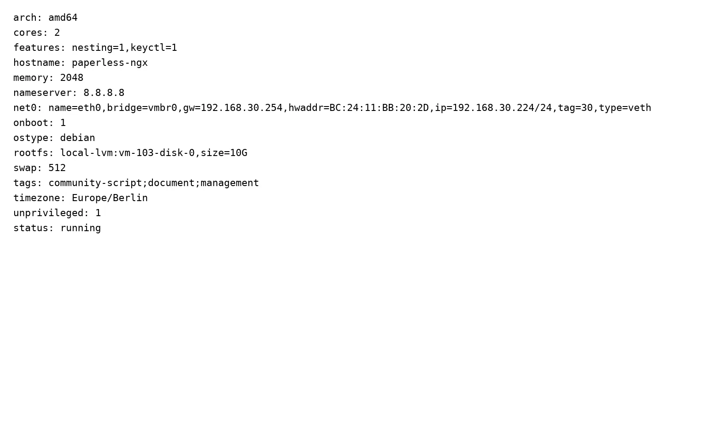
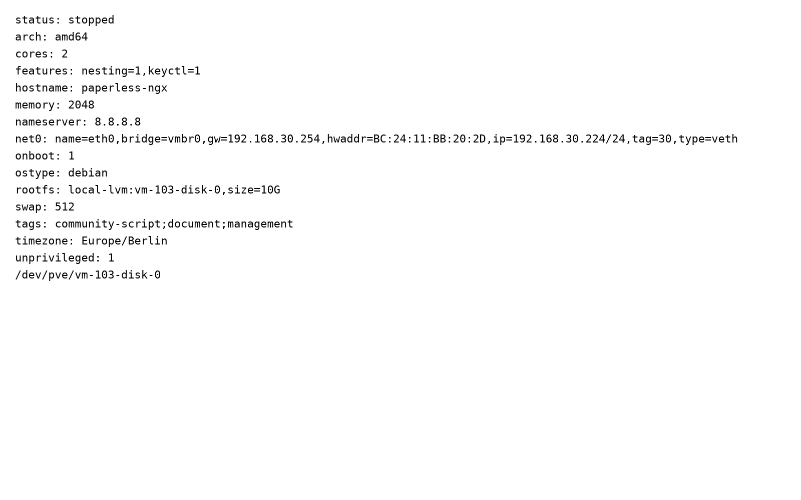

+++
title = "Paperless-ngx im Proxmox-LXC installieren: Dokumente selbst hosten und archivieren"
description = "Paperless-ngx in einem Proxmox-LXC einrichten, OCR mit einem Testdokument prüfen und Backup-Grenzen vor dem Produktivbetrieb klären."
date = 2026-09-17
draft = true
robotsNoIndex = true
ShowToc = true
ShowShareButtons = false
preview = true
preview_content_type = "article_draft"
publish_eligible = false
content_state = "user_review_required"
approved_for_publish = false
content_role = "GROWTH"
monetization_target = "NONE"
tags = ["paperless-ngx", "proxmox", "lxc", "homelab", "ocr"]
categories = ["Homelab", "Virtualisierung"]
+++

Paperless-ngx im Proxmox-LXC installieren: Dokumente selbst hosten und archivieren

Transparenz zum Labortest: Auf PVE04 gab es nacheinander zwei verschiedene Container mit derselben CT-ID 103. Der erste war der unprivilegierte Debian-13-LXC des Compose-Installations- und OCR-Laufs vom 17. September 2026. Er lag im Testnetz VLAN 30, nutzte vorübergehend `192.168.30.222/24` mit Gateway `192.168.30.254`, hatte 3072 MiB RAM und 12 GiB Root-Disk. Im Gast war `8.8.8.8` ausdrücklich als DNS-Server gesetzt. Import und OCR wurden ausschließlich mit einem synthetischen PDF geprüft. Die Suche wurde nicht unabhängig über eine authentifizierte Sitzung getestet. Auch Backup und Restore wurden nicht ausgeführt. Nach dem Test wurde dieser erste CT 103 vollständig gelöscht; CT 101 und CT 102 blieben unverändert. Zum Compose-Lauf wurden keine Screenshot-Dateien übergeben.[7]

Der danach unter CTID 103 angelegte LXC stammt aus dem offiziellen Community-Script-Lauf auf PVE04. Er nutzte 2 GiB RAM, 10G Root-Disk, VLAN 30, `192.168.30.224/24`, Gateway `192.168.30.254`, DNS `8.8.8.8`, Debian 13 und eine unprivilegierte Konfiguration. Beim Read-only-Check am 18. September 2026 waren die Paperless-Systemdienste aktiv. Anschließend wurde der Script-Container gestoppt und behalten.[8] Das ist kein vollständiger bestandener Script-Abnahmetest: Der zugehörige Script-Task endete nach 1203 Sekunden im Timeout; der authentifizierte Search-Test sowie Backup und Restore blieben offen. Von den fünf übergebenen WEBP-Dateien werden vier verwendet. `network.webp` war vollständig leer und wurde deshalb nicht eingebunden.[8]

## 1. Kurzantwort und Ergebnis des PVE04-Tests

Paperless-ngx lässt sich in einem Proxmox-LXC betreiben. Im PVE04-Test starteten Docker, Docker Compose, PostgreSQL 16, Redis 7 und der Paperless-Webserver. Die Anmeldeseite war unter `http://192.168.30.222:8000` erreichbar. Ein synthetisches PDF wurde als Dokument 1 verarbeitet; die Protokolle meldeten einen erfolgreichen OCR-Lauf, eine PDF/A-2b-Ausgabe und den abgeschlossenen Import.[7]

Das ist ein belastbarer Nachweis für Installation, WebUI-Erreichbarkeit und genau diesen OCR-Import. Es ist kein vollständiger Abnahmetest. Insbesondere fehlen ein eigenständiger Suchtest sowie ein gesicherter und anschließend zurückgespielter Datenbestand.[7]

Für den schnellen Einstieg gibt es ein Community-Script für Proxmox VE. Der Installations- und OCR-Lauf aus Run 91 nutzte dieses Script nicht: Um den Netzwerktest reproduzierbar einzugrenzen, wurden Docker und Docker Compose aus Debian-Paketen installiert und danach eine fest definierte Compose-Konfiguration mit Redis 7, PostgreSQL 16 und dem Image `ghcr.io/paperless-ngx/paperless-ngx:latest` gestartet.[7] Später wurde die Community-Script-Route auf PVE04 in einem neuen Container mit derselben CTID 103 ausgeführt.[8] Die Ergebnisse beider Container dürfen nicht vermischt werden.


*Reales Evidence-Rendering aus dem Script-Container CT 103 vom 18. September 2026, kein Mockup: Im Bild sind fünf Zeilen mit dem Status `active` zu sehen; Dienstnamen, Prüfkommando und Listener sind darin nicht sichtbar. Die Zuordnung zu `paperless-webserver`, `paperless-task-queue`, `paperless-consumer`, `postgresql` und `redis-server` sowie die Listener auf 8000, 5432 und 6379 stammen aus dem Evidence-Manifest.[8]*

## 2. Voraussetzungen und Testgrenzen

Du brauchst:

- einen Proxmox-VE-Host mit freier CT-ID und geeignetem Storage,
- ein Debian-LXC-Template,
- eine freie IP-Adresse oder DHCP-Reservierung,
- funktionierendes Routing und DNS aus dem Gast,
- ausreichend Speicher für Originale, Archivdateien, Vorschaubilder und Datenbank,
- einen Plan für Sicherung und Wiederherstellung, bevor echte Dokumente importiert werden.

Als Startwerte dienten im Labor 2 CPU-Kerne, 3072 MiB RAM und 12 GiB Root-Disk. Das sind Beispielwerte aus diesem Test, keine allgemeine Kapazitätsgarantie. OCR kann CPU und Arbeitsspeicher belasten; der Speicherbedarf wächst mit dem Archiv. Miss die Auslastung mit deinen eigenen Dokumenttypen und plane freien Speicher ein.

Der Container war unprivilegiert. Proxmox beschreibt unprivilegierte Container als Standard bei der Neuanlage; dabei wird Root im Gast auf einen unprivilegierten Benutzer außerhalb des Containers abgebildet. Für verschachtelte Container muss die LXC-Option `nesting` aktiviert sein.[5]

Der Labortest deckte nur einen kleinen, bewusst kontrollierten Ausschnitt ab:

- ein synthetisches PDF statt persönlicher Unterlagen,
- ein einzelner erfolgreicher Import,
- keine unabhängig geprüfte Volltextsuche,
- kein Mehrbenutzer- oder Rechte-Test,
- kein Update-Test,
- kein Backup und kein Restore,
- keine Langzeitbeobachtung.

## 3. Community-Script: Quelle, Annahmen und Versionsstand

Die Script-Seite des Community-Projekts stellt einen Installationsbefehl für die Proxmox-Shell bereit. Sie nennt Englisch als Standard-OCR-Sprache und `apt-get install tesseract-ocr-deu` für das deutsche Sprachpaket. Für Management-Befehle weist sie darauf hin, bei dieser Installation `uv run` voranzustellen.[1]

Die Script-Seite dokumentierte am Abrufdatum folgendes Installationsprofil: Debian 13, 2 CPU-Kerne, 3072 MB RAM, 12 GB Disk, Port 8000, die Konfiguration unter `/opt/paperless/paperless.conf` und den Hinweis „Runs in PVE“.[1] Dieses Profil ist der Dokumentationsstand der Script-Route; es ist weder eine Messung auf PVE04 noch eine Zusage für Mindestanforderungen.[1]

Für die Script-Route brauchst du einen Proxmox-VE-Host mit Shell- und Root-Zugriff für den Installationsbefehl, eine freie CT-ID, einen im Zielnetz kollisionsfreien Hostnamen, ausreichend Storage sowie funktionierende Netz- und DNS-Auflösung (siehe Kapitel 9 zu DNS- und Repository-Timeouts).[1][5] Auf PVE04 wurde diese Route ausgeführt: Der Script-Lauf erzeugte CT 103 mit 2 CPU-Kernen, 2048 MiB RAM, 10G Disk, Debian 13, unprivilegierter Konfiguration, VLAN 30, `192.168.30.224/24`, Gateway `192.168.30.254` und DNS `8.8.8.8`; beim späteren Read-only-Check waren die Paperless-Dienste aktiv.[8] Der Script-Task endete jedoch nach 1203 Sekunden im Timeout. Weil ein authentifizierter Search-Test sowie Backup und Restore fehlen, bleibt `PVE04_SCRIPT_EVIDENCE=BLOCKED`.[8]

Führe keinen aus dem Internet geladenen Shell-Code ungeprüft als Root aus. Öffne zuerst die offizielle Script-Seite, folge von dort zum Repository und lies den aktuellen Inhalt. Die Seite warnt selbst vor Nachahmerseiten und empfiehlt, Quelle und Script zu prüfen.[1]

Wichtig für reproduzierbare Anleitungen: Die Script-Seite zeigte beim Abruf am 17. September 2026 Paperless-ngx v3.1.3 als neueste Upstream-Version. Zugleich weist sie ausdrücklich darauf hin, dass die angezeigte Upstream-Version von der Version abweichen kann, die das Script tatsächlich installiert.[1] Behandle Versionsnummern, Debian-Basis, Datenbank und Ressourcenprofile deshalb als Momentaufnahme. Notiere vor jeder Installation:

1. Datum und Quell-URL,
2. Commit oder Script-Stand,
3. ausgewählte CT-ID, Ressourcen und Storage,
4. installierte Paperless-Version nach dem ersten Start.

Das Community-Script ist eine bequeme Installationshilfe, aber kein offizieller Bestandteil von Paperless-ngx oder Proxmox VE. Die offizielle Paperless-Dokumentation beschreibt ein eigenes Installationsscript für Docker Compose, bereitgestellte Compose-Dateien und eine Bare-Metal-Installation. Für die meisten Nutzer empfiehlt sie Docker.[2]

## 4. LXC auf Proxmox anlegen

Lege zuerst einen separaten Testcontainer an. Die folgende Tabelle gehört ausschließlich zum gelöschten Run-91-Compose-Container, nicht zum späteren Script-Container mit derselben CTID:

| Einstellung | PVE04-Beispiel: Run-91-Compose-LXC | Einordnung |
|---|---:|---|
| CT-ID | 103 | Nur im Test frei; vorher prüfen |
| Hostname | `paperless-test` | Frei wählbar |
| Template | Debian 13 | Im Labor verwendet |
| Unprivilegiert | Ja | Proxmox-Standard für neue CTs |
| Nesting | Ja | Für Docker im LXC benötigt |
| CPU | 2 Kerne | Startwert, später messen |
| RAM | 3072 MiB | Startwert, später messen |
| Root-Disk | 12 GiB auf `local-lvm` | Für echte Archive meist zu knapp planen |
| Bridge | `vmbr0` | Laborspezifisch |
| VLAN-Tag | 30 | Laborspezifisch, nicht kopieren |
| IPv4 | `192.168.30.222/24` | Temporäre Laboradresse |
| Gateway | `192.168.30.254` | Laborspezifisch |
| DNS | `8.8.8.8` | Nur zur Fehlerisolierung im Test |
| Firewall | aktiviert | Laborkonfiguration |

VLAN 30, IP, Gateway, Bridge und DNS sind keine Empfehlungen für dein Netz. Übernimm die Werte aus deinem eigenen IP-, VLAN- und DNS-Plan. Wenn du einen internen Resolver nutzt, sollte dieser die nötigen externen Namen zuverlässig auflösen können.

Die folgende Abbildung gehört nicht zu den Tabellenwerten des gelöschten Compose-LXC vom 17. September. Sie dokumentiert den anschließend unter derselben CTID 103 angelegten Community-Script-Container: 2 Kerne, 2048 MiB RAM, 10G Root-Disk, Debian 13, unprivilegiert, `nesting=1`, VLAN 30, `192.168.30.224/24`, Gateway `192.168.30.254` und DNS `8.8.8.8`.[8]



*Reales Evidence-Rendering aus CT 103, kein Mockup: Konfigurations-Read-back mit 2 GiB RAM, 10G Disk, VLAN 30, `192.168.30.224/24`, Gateway `192.168.30.254` und DNS `8.8.8.8`.[8]*

Prüfe das Netz im Gast, bevor du Paperless installierst:

```bash
ip route
cat /etc/resolv.conf
getent hosts deb.debian.org
ping -c 3 <dein-gateway>
apt-get update
```

Auf PVE04 funktionierte erst der abschließende Zustand mit genau einem eingetragenen Resolver, `nameserver 8.8.8.8`. Danach waren Gateway und Resolver erreichbar, `getent hosts deb.debian.org` lieferte Adressen und `apt-get update` endete mit Exit 0.[7] Das beweist nicht, dass 8.8.8.8 die richtige Dauerlösung für andere Netze ist. Es zeigt nur, dass der vorherige Fehler im Labor am Namensauflösungsweg eingegrenzt werden konnte.

Danach gibt es zwei Wege:

- Community-Script: Nutze den aktuellen Befehl ausschließlich von der offiziellen Script-Seite und dokumentiere den Stand.[1]
- Manuelle Compose-Route: Installiere Docker und Docker Compose, lade eine offizielle Compose-Vorlage und passe `.env` sowie `docker-compose.env` an. Die Paperless-Dokumentation empfiehlt für neue Installationen PostgreSQL und nennt `docker compose pull` sowie `docker compose up -d` als Startfolge.[2]

Der Run-91-Installations- und OCR-Nachweis gilt nur für die Compose-Route. Dort kamen Debian-Pakete für Docker und Compose sowie eine laborspezifische Compose-Datei zum Einsatz.[7] Der spätere Script-Lauf ist separat belegt, blieb wegen der offenen Search- und Backup-/Restore-Prüfungen aber im Status `BLOCKED`.[8] Übertrage keine Ergebnisse zwischen den beiden Installationsarten.

## 5. Paperless initial konfigurieren

Rufe nach dem Start `http://<LXC-IP>:8000` nur aus einem vertrauenswürdigen Netz auf. Die offizielle Compose-Anleitung beschreibt Port 8000 als Standard und fordert beim ersten Zugriff zum Anlegen eines Superusers auf.[2]

Arbeite danach diese Punkte ab:

1. Erzeuge ein langes, einmaliges Administratorkennwort und speichere es in einem Passwortmanager.
2. Lege für den Alltag ein normales Benutzerkonto an. Die Dokumentation erinnert daran, dass Superuser auf alle Objekte und Dokumente zugreifen können.[2]
3. Setze Zeitzone und OCR-Sprache passend zu deinen Dokumenten. Für deutsche OCR ist `deu` beziehungsweise das Paket `tesseract-ocr-deu` relevant.[1][2]
4. Prüfe `PAPERLESS_SECRET_KEY`. Bei einer manuellen Installation muss er zufällig sein; laut Dokumentation schützt er die Authentifizierung vor gefälschten Anmeldedaten.[2]
5. Wenn ein Reverse Proxy vorgeschaltet ist, setze `PAPERLESS_URL` passend zur externen URL.[2]
6. Kontrolliere, wo `consume`, `data`, `media` und die PostgreSQL-Daten tatsächlich persistent gespeichert werden.

Bei Docker gehört die Konfiguration in die Compose-Umgebung; `paperless.conf` wird dort nicht verwendet. Paperless kann ausgewählte OCR-Einstellungen auch über die Oberfläche speichern, wobei UI-Werte Vorrang vor Umgebungsvariablen haben. Die dafür nötige `AppConfig`-Berechtigung gilt instanzweit und sollte wie eine Administratorberechtigung behandelt werden.[4]

## 6. Synthetisches Dokument importieren und OCR prüfen

Verwende für den ersten Lauf kein Steuerdokument, keinen Ausweis und keine echte Rechnung. Erstelle stattdessen ein PDF mit eindeutigem Fantasietext, etwa einer erfundenen Vorgangsnummer. So kannst du Verarbeitung und Suche prüfen, ohne persönliche Daten in einen noch ungetesteten Aufbau zu laden.

Ein sinnvoller Testablauf:

1. Lade das synthetische PDF über die Weboberfläche hoch oder lege es im konfigurierten Consume-Verzeichnis ab.
2. Beobachte Aufgabenstatus und Logs, bis die Verarbeitung beendet ist.
3. Öffne das Dokument und prüfe, ob Original, Vorschau und archivierte Fassung vorhanden sind.
4. Vergleiche mehrere erkennbare Wörter mit dem sichtbaren PDF.
5. Suche anschließend nach der eindeutigen Fantasie-Vorgangsnummer.
6. Melde dich mit einem normalen Benutzer an und prüfe, ob dessen Rechte wie vorgesehen greifen.

Auf PVE04 waren Import, `pdftotext`, OCR-Pipeline und PDF/A-2b-Erzeugung erfolgreich.[7] Schritt 5 wurde dort nicht unabhängig über die authentifizierte WebUI oder API ausgeführt. Der Artikel behauptet deshalb keinen bestandenen Suchtest. Genau dieser Test gehört vor dem Produktivbetrieb noch auf die Checkliste.

## 7. Betrieb und Sicherheit

Behandle Paperless als System mit vertraulichen Daten, nicht als beliebige Homelab-Demo.

- Veröffentliche Port 8000 nicht direkt im Internet.
- Begrenze den Zugriff per Firewall auf benötigte Netze und Geräte.
- Nutze für externen Zugriff eine bewusst konfigurierte, TLS-geschützte Zugangslösung.
- Verwende normale Benutzerkonten für den Alltag und vergebe Rechte sparsam.
- Halte Betriebssystem, Paperless, Datenbank und Broker aktuell. Lies vor Updates die Release- und Migrationshinweise.
- Sichere Konfigurationsdateien und Secrets gegen unbefugten Zugriff. Schreibe Kennwörter, Tokens oder Cookies nicht in Anleitungen und Tickets.
- Prüfe freien Speicher, fehlgeschlagene Tasks und Logs regelmäßig.

Für Docker-Updates nennt die offizielle Administration nach Backup und Stoppen der aktiven Verarbeitung `docker compose pull` und `docker compose up`. Die Compose-Dateien mit `latest` folgen dabei dem jeweils neuesten stabilen Release. Wer Änderungen kontrollierter einspielen will, kann laut Dokumentation eine Release-Serie pinnen und sollte trotzdem vor jedem Update die Release Notes lesen.[3]

Automatische Updates ohne vorherigen Restore-Test sind für ein Dokumentenarchiv keine gute Abkürzung. Plane Wartungsfenster, protokolliere die installierte Version und halte einen Rückweg bereit.

## 8. Backup und Restore: Anforderungen und offene PVE04-Tests

Ein Proxmox-Backup allein ist noch kein nachgewiesener Wiederherstellungsplan. Paperless speichert je nach Installation Dokumente, Vorschaubilder, Anwendungsdaten und Datenbank an mehreren Stellen.

Die offizielle Paperless-Dokumentation nennt zwei wichtige Strategien:

- Der Document Exporter schreibt Dokumente, Vorschaubilder, Metadaten und Datenbankinhalte in ein Zielverzeichnis. API-Tokens sind nicht enthalten und müssen nach einem Import neu erzeugt werden. Export und Import müssen mit derselben Paperless-Version erfolgen.[3]
- Bei Docker können die persistenten Volumes gesichert werden. Dokumentiert sind unter anderem `paperless_media`, `paperless_data` und bei PostgreSQL `paperless_pgdata`.[3]

Bei einer Bare-Metal-Installation muss zusätzlich zum Paperless-Ordner die externe PostgreSQL- oder MariaDB-Datenbank gesichert werden.[3] In einer Compose-Installation gilt entsprechend: Ermittle anhand deiner Compose-Datei, welche Volumes oder Bind-Mounts existieren. Sichere nicht nur das LXC-Root-Dateisystem, wenn Daten außerhalb davon eingebunden sind.

Für den Document Exporter zeigt die Docker-Dokumentation beispielsweise:

```bash
docker compose exec -T webserver document_exporter ../export
```

Die Community-Script-Seite weist für ihre `uv`-Installation dagegen auf Befehle mit `uv run` hin.[1][3] Verwende daher immer die Syntax deiner tatsächlichen Installationsart.

Ein belastbarer Restore-Test braucht ein getrenntes Ziel:

1. Verarbeitung anhalten und einen vollständigen Export beziehungsweise konsistenten Backup-Satz erstellen.
2. Version, Compose-Datei, Umgebungsdateien und Speicherorte dokumentieren.
3. In einem neuen Test-LXC dieselbe Paperless-Version bereitstellen.
4. Daten importieren oder Volumes und Datenbank nach dem gewählten Verfahren wiederherstellen.
5. Dokumentanzahl, Stichproben, Metadaten, OCR-Inhalt, Suche und Benutzerrechte prüfen.
6. Ergebnis und benötigte Zeit protokollieren.

Auf PVE04 wurde keiner dieser Schritte durchgeführt. Es gibt keine Backup- oder Restore-Protokolle.[7][8] Der zusätzliche read-only Check vom 18. September führte `pvesm list local --content backup` aus. Die Ausgabe enthielt nur die Kopfzeile und keine Backup-Zeile. Es wurde weder ein Backup noch ein Restore gestartet.[8] Der Teststatus bleibt deshalb eingeschränkt, obwohl Installation und OCR-Import im früheren Lauf erfolgreich waren.


*Reales Evidence-Rendering aus dem PVE04-Check zum Script-Container CT 103, kein Mockup: Sichtbar sind nur die Kopfzeile des Storage-Checks und `status: running`. Das Kommando `pvesm list local --content backup` ist im Ausschnitt nicht sichtbar; seine Zuordnung stammt aus dem Evidence-Manifest. Es gab keine Backup-Zeile, und die Statuszeile ist kein Backup-Nachweis.[8]*



*Reales Evidence-Rendering aus CT 103, kein Mockup: Nach den Prüfungen war der Container gestoppt und blieb erhalten. Der Storage-Pfad `/dev/pve/vm-103-disk-0` sowie die Konfiguration mit 2 GiB RAM, 10G Disk, VLAN 30, `192.168.30.224/24`, Gateway `192.168.30.254` und DNS `8.8.8.8` waren im finalen Read-back weiterhin vorhanden.[8]*

Ein authentifizierter Search-Test wurde auch bei diesem zweiten Check nicht durchgeführt. Im Task-Kontext lag keine freigegebene Paperless-Sitzung und kein freigegebenes Benutzerkonto vor. Es wurden keine Zugangsdaten angefordert oder erraten; daher gibt es weiterhin keinen Nachweis für eine erfolgreiche authentifizierte Suche.[8]

## 9. Typische Fehler: DNS, Rechte, OCR und Updates

### `apt-get update` oder Image-Pull läuft in einen Timeout

Prüfe zuerst Route und Namensauflösung getrennt:

```bash
ip route
cat /etc/resolv.conf
getent hosts deb.debian.org
ping -c 3 <dein-gateway>
```

Erreicht der Gast das Gateway, kann aber keine Namen auflösen, kontrolliere DNS-Einstellung, VLAN-Regeln und Firewall. Auf PVE04 war ein explizit gesetzter Resolver der erfolgreiche Testzustand.[7] Verwende im Dauerbetrieb den Resolver, der zu deinem Netz und Datenschutzmodell gehört.

### Docker startet im LXC nicht

Kontrolliere, ob der LXC unprivilegiert angelegt und `nesting=1` gesetzt wurde. Prüfe anschließend die Dienst- und Containerlogs. Ändere nicht wahllos Sicherheitsoptionen am Proxmox-Host; grenze den Fehler zuerst im Test-LXC ein.

### Dateien im Consume-Verzeichnis werden nicht verarbeitet

Prüfe Pfad, Mount und Schreibrechte. Bei Dateisystemen ohne `inotify`, etwa manchen NFS-Setups, empfiehlt die Paperless-Dokumentation ein positives `PAPERLESS_CONSUMER_POLLING_INTERVAL`.[2]

### Deutsche Wörter werden schlecht erkannt

Kontrolliere, ob das deutsche Tesseract-Sprachpaket installiert ist und `PAPERLESS_OCR_LANGUAGE` zur Vorlage passt.[1][2] Teste mehrere typische Scanqualitäten, bevor du alte Ordner stapelweise importierst.

### Export lässt sich nicht importieren

Vergleiche Quell- und Zielversion. Die offizielle Dokumentation warnt davor, einen Export in eine andere Paperless-Version zu importieren, weil Datenbankmigrationen das Schema ändern können.[3]

### Nach einem Update fehlen Funktionen oder Migrationen schlagen fehl

Stoppe weitere Änderungen, lies die Migrationshinweise der verwendeten Version und arbeite vom geprüften Backup aus. Die Administration nennt für Bare Metal neben Datenbankmigrationen bei Bedarf auch den Neuaufbau des Suchindex.[3]

## 10. Fazit, Checkliste und nächster Schritt

Der PVE04-Lauf beantwortet eine eng gefasste Frage: Paperless-ngx ließ sich in einem unprivilegierten Debian-13-LXC mit verschachteltem Docker starten, und ein synthetisches PDF durchlief den OCR-Prozess erfolgreich.[7] Er beantwortet noch nicht, ob Suche, Rechte und Wiederherstellung in einer realen Umgebung zuverlässig funktionieren.

Checkliste vor echten Dokumenten:

- [ ] Community-Script oder Compose-Dateien aus offizieller Quelle geprüft
- [ ] Installationsstand und Paperless-Version notiert
- [ ] Eigene IP-, VLAN-, DNS- und Firewall-Werte verwendet
- [ ] Normales Benutzerkonto mit passenden Rechten getestet
- [ ] Deutsche OCR mit mehreren synthetischen Dokumenten geprüft
- [ ] Eindeutigen Begriff über die authentifizierte Suche gefunden
- [ ] Datenpfade, Volumes und Bind-Mounts dokumentiert
- [ ] Backup erstellt und in einem getrennten Test-LXC wiederhergestellt
- [ ] Dokumente, Metadaten, Suche und Rechte nach dem Restore geprüft
- [ ] Update- und Rollback-Ablauf dokumentiert

Setze Paperless-ngx zuerst in einem separaten Test-LXC auf. Prüfe OCR und Suche mit synthetischen Dateien. Lege danach deinen Backup- und Restore-Plan fest und beweise ihn mit einer Wiederherstellung. Erst dann gehören produktive Dokumente in das System.

## Quellen

[1] Proxmox VE Helper Scripts, "Paperless-ngx": https://community-scripts.org/scripts/paperless-ngx (abgerufen am 17.09.2026)

[2] Paperless-ngx, "Installation": https://docs.paperless-ngx.com/setup/ (abgerufen am 17.09.2026)

[3] Paperless-ngx, "Administration": https://docs.paperless-ngx.com/administration/ (abgerufen am 17.09.2026)

[4] Paperless-ngx, "Configuration": https://docs.paperless-ngx.com/configuration/ (abgerufen am 17.09.2026)

[5] Proxmox VE, "Linux Container": https://pve.proxmox.com/wiki/Linux_Container (abgerufen am 17.09.2026)

[6] Community Scripts, Quell-Repository: https://github.com/community-scripts/ProxmoxVE (verlinkt über die offizielle Script-Seite; abgerufen am 17.09.2026)

[7] Interner PVE04-Testbericht, Run 91: `PVE04-paperless-retry-report.txt` (17.09.2026; dem Redaktions-Handoff beigefügt)

[8] Internes PVE04-Evidence-Manifest zum Community-Script-Container mit vier verwendeten realen WEBP-Renderings: `evidence-manifest.txt`, `ct103-config.webp`, `services.webp`, `backup.webp` und `final-readback.webp` (18.09.2026; dem Redaktions-Handoff beigefügt). Das ebenfalls übergebene `network.webp` war vollständig leer und wird nicht verwendet.
