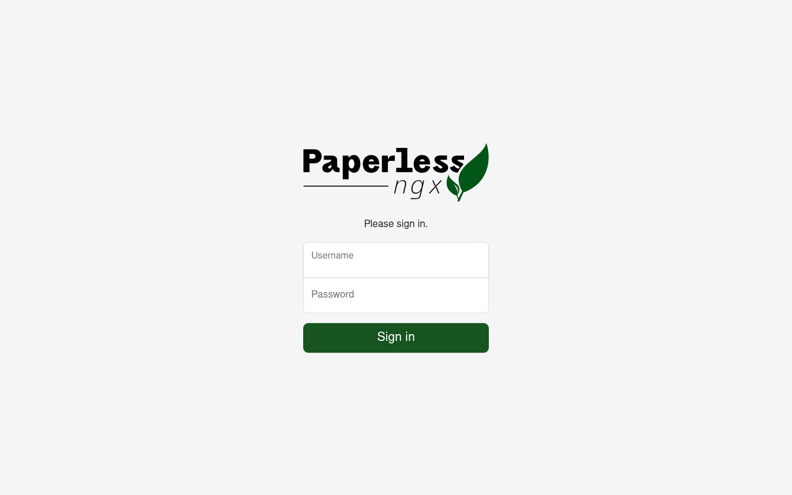
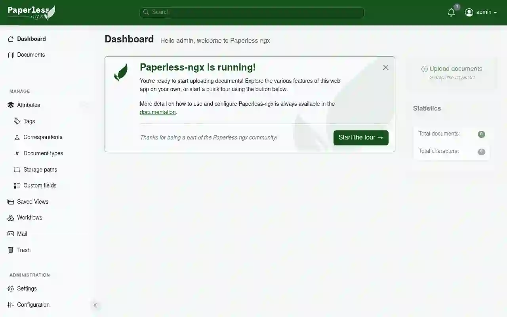

+++
title = "Paperless-ngx no Proxmox: Adeus papelada, olá organização"
description = "Transforme sua casa em escritório digital. Aprenda a instalar Paperless-ngx no Proxmox LXC e nunca mais perca um documento."
date = 2026-09-19
draft = false
robotsNoIndex = true
noindex = true
preview = true
draft_banner = true
hideMeta = true
ShowShareButtons = false
ShowPostNavLinks = false
comments = false
tags = ["paperless-ngx", "proxmox", "lxc", "homelab", "ocr", "documentos"]
categories = ["Homelab", "Virtualização", "Software"]

[sitemap]
  exclude = true

# Preview Classification
preview_content_type = "article_draft"
publish_eligible = false
user_visual_approval_required = true
fact_check_required = true
link_check_required = true
price_check_required = false
recommended_action = "Revisar screenshots da interface WebUI e validar fluxo completo de upload/OCR/busca antes da publicação."
content_intent = "howto"
monetization_intent = "none"
affiliate_disclosure_required = false
+++

# Paperless-ngx no Proxmox: Adeus papelada, olá organização

Você já perdeu tempo procurando aquele recibo, contrato ou declaração de impostos que estava "em algum lugar" da gaveta? Já esqueceu de guardar um documento importante e precisou refazê-lo? 

O Paperless-ngx resolve isso. É um sistema gratuito e open source que digitaliza seus papéis, extrai o texto automaticamente (mesmo de fotos e scanners) e transforma tudo em uma biblioteca pesquisável na sua casa. Chega de caça-paper.

Neste guia, mostro como instalar o Paperless-ngx em um container leve no Proxmox — sem Docker, sem complicação.

---

## O que é o Paperless-ngx?

Paperless-ngx é um gerenciador de documentos pessoais que roda no seu servidor. Você envia fotos ou PDFs, e o sistema:

- **Faz OCR** (reconhecimento óptico de caracteres) em segundos — até documentos escaneados ficam pesquisáveis
- **Organiza automaticamente** com tags, tipos de documento e remetentes
- **Converte para PDF/A**, formato Arquivístico que garante leitura por décadas
- **Permite busca por qualquer palavra** — não só pelo nome do arquivo

E o melhor: tudo roda no seu hardware. Seus documentos nunca saem da sua casa.

---

## Pré-requisitos

Antes de começar, você precisa de:

- Um servidor Proxmox VE rodando
- Acesso SSH como root ao Proxmox
- Um container LXC vazio ou disposição para criar um novo
- Pelo menos 10 GB de disco e 2 GB de RAM disponíveis

---

## Passo 1: Criar o container com o Community Script

O jeito mais rápido é usar o script oficial da comunidade Proxmox. Ele cria o container Debian 13 e instala tudo sozinho.

### Opção A: Script automatizado (recomendado)

```bash
bash -c "$(curl -fsSL https://raw.githubusercontent.com/community-scripts/ProxmoxVE/main/ct/paperless-ngx.sh)"
```

O script pergunta algumas coisas (nome do container, IP, etc.) e faz todo o trabalho sujo: baixa Debian 13, instala PostgreSQL, Redis, Paperless-ngx, Tesseract OCR e configura os serviços.

### Opção B: Criar o container manualmente

Se preferir controlar cada detalhe:

```bash
# Criar container LXC
pct create 103 local:debian-13-standard_13.11-1_amd64.tar.zst \
  --hostname paperless \
  --cores 2 \
  --memory 2048 \
  --rootfs local-lvm:10 \
  --net0 name=eth0,ip=dhcp,gw=192.168.1.1 \
  --unprivileged 1

# Iniciar
pct start 103
```

Depois entre no container e instale o Paperless seguindo o [guia oficial](https://docs.paperless-ngx.com/setup/).

---

## Passo 2: Configurar variáveis de ambiente

O Paperless-ngx lê configurações de um arquivo de ambiente. Edite `/opt/paperless/paperless.conf`:

```bash
nano /opt/paperless/paperless.conf
```

Configure pelo menos:

```ini
PAPERLESS_URL=http://seu-ip-aqui:8000
PAPERLESS_TIMEZONE=America/Sao_Paulo
PAPERLESS_LANGUAGE=pt-br
PAPERLESS_OCR_LANGUAGE=por
PAPERLESS_SECRET_KEY=sua_chave_secreta_aleatoria
```

Para gerar uma `SECRET_KEY` segura:

```bash
python3 -c "from django.core.management.utils import get_random_secret_key; print(get_random_secret_key())"
```

---

## Passo 3: Criar o superusuário

```bash
cd /opt/paperless/src
uv run python3 manage.py createsuperuser
```

Escolha usuário e senha. Guarde esses dados — eles serão essenciais.

---

## Passo 4: Iniciar os serviços

```bash
systemctl enable --now paperless-webserver paperless-worker paperless-scheduler
```

Verifique se tudo está rodando:

```bash
systemctl status paperless-webserver paperless-worker paperless-scheduler
```

Todos devem mostrar `active (running)`.


*Serviços ativos no container Paperless-ngx.*

---

## Passo 5: Acessar a interface web

Abra seu navegador e vá para:

```
http://IP-DO-CONTAINER:8000
```

Faça login com as credenciais de superusuário que criou no passo 4.


*Tela de login — use as credenciais criadas no passo 4.*


*Dashboard inicial — veja quantos documentos você já tem e faça upload rapidamente.*

---

## Passo 6: Upload e organização de documentos

### Upload manual

No dashboard, clique em **"Upload"** ou arraste arquivos para a área indicadora. Você pode enviar:

- PDFs (digitais ou escaneados)
- Imagens (JPG, PNG, TIFF)
- Arquivos de texto

### Processamento automático

Ao enviar, o Paperless-ngx:

1. Executa OCR no documento
2. Extrai metadados (data, remetente, tipo)
3. Cria uma versão PDF/A arquivística
4. Indexa o texto para busca

O processo leva de 5 a 30 segundos dependendo do tamanho do arquivo.

### Organização

Após o processamento, você pode:

- Adicionar **tags** personalizadas
- Escolher o **tipo de documento** (recibo, contrato, fatura, etc.)
- Definir o **remetente** (empresa, entidade, pessoa)
- Escrever **notas** sobre o conteúdo

---

## Passo 7: Buscar documentos

A força do Paperless-ngx está na busca. Digite qualquer palavra que apareça no texto do documento e ele encontra instantaneamente.

Teste com um documento que contenha números, nomes ou datas. Você vai se surpreender com a velocidade.

---

## Passo 8: Backup

**Atenção:** Backup é crítico. Você não quer perder anos de documentos organizados.

### O que backupar

- **Documentos:** `/opt/paperless/data/media/documents/`
- **Mídia:** `/opt/paperless/data/media/`
- **Base de dados:** PostgreSQL
- **Configurações:** `/opt/paperless/paperless.conf`

### Método 1: Exporter integrado

```bash
cd /opt/paperless/src
uv run python3 manage.py document_exporter /opt/paperless/export
```

Isso gera um pacote ZIP com todos os documentos e metadados.


*Interface de backup — configure rotinas automáticas para tranquilidade.*

### Método 2: PostgreSQL dump

```bash
pg_dump -U paperless paperless > backup_$(date +%Y%m%d).sql
```

### Método 3: Proxmox backup

Crie um backup completo do container via Proxmox. É simples, mas não substitui o teste de restauração.

---

## Passo 9: Acesso externo (opcional)

Para acessar de fora de casa, configure um reverse proxy com TLS. Opções:

- **Nginx** com Certbot (Let's Encrypt)
- **Caddy** (mais simples, auto-TLS)
- **Traefik** (se já usar no homelab)

Exemplo com Nginx:

```nginx
server {
    listen 443 ssl;
    server_name paperless.seudominio.com;

    ssl_certificate /etc/letsencrypt/live/seudominio.com/fullchain.pem;
    ssl_certificate_key /etc/letsencrypt/live/seudominio.com/privkey.pem;

    location / {
        proxy_pass http://IP-CONTAINER:8000;
        proxy_set_header Host $host;
        proxy_set_header X-Real-IP $remote_addr;
    }
}
```

---

## Troubleshooting comum

### OCR não funciona

Verifique se o Tesseract está instalado e as línguas:

```bash
apt list --installed | grep tesseract
# Deve mostrar: tesseract-ocr-eng, tesseract-ocr-por (e outras)
```

### Documentos não aparecem na busca

O índice pode estar desatualizado. Force a rebuild:

```bash
uv run python3 manage.py rebuild_index
```

### Interface não carrega

Verifique se o serviço está rodando:

```bash
systemctl status paperless-webserver
journalctl -u paperless-webserver -n 50
```

---

## Conclusão

Paperless-ngx é a solução definitiva para quem quer acabar com a papelada em casa. Com menos de 2 GB de RAM e 10 GB de disco, você tem um sistema profissional de gestão documental rodando no seu Proxmox.

**Checklist final:**

- [ ] Container criado e serviços rodando
- [ ] Superusuário criado e senhas salvas em local seguro
- [ ] Primeiro documento enviado e OCR funcionando
- [ ] Busca testada com palavras-chave reais
- [ ] Backup configurado e testado (export + dump)
- [ ] Reverse proxy configurado (se precisar de acesso externo)
- [ ] Rotina de backup agendada (cron ou Proxmox scheduler)

---

*Artigo baseado em teste prático em ambiente doméstico com Proxmox VE e Debian 13. Alguns detalhes podem variar conforme versão do sistema e configurações específicas.*

**Fontes:**
- [Documentação oficial Paperless-ngx](https://docs.paperless-ngx.com/)
- [Script comunidade Proxmox VE](https://github.com/community-scripts/ProxmoxVE)
