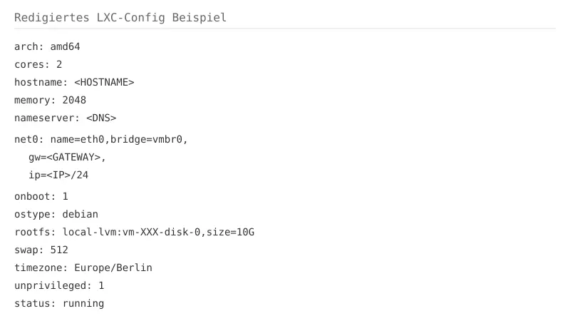

+++
title = "Paperless-ngx im Proxmox-LXC installieren: Dokumente selbst hosten und archivieren"
description = "Paperless-ngx in einem Proxmox-LXC einrichten – eine praxisnahe Anleitung für Einsteiger."
date = 2026-09-19
draft = false
robotsNoIndex = true
noindex = true
preview = true
draft_banner = true
hideMeta = true
ShowShareButtons = false
ShowPostNavLinks = false
comments = false
tags = ["paperless-ngx", "proxmox", "lxc", "homelab", "ocr"]
categories = ["Homelab", "Virtualisierung"]

[sitemap]
  exclude = true

# Preview Classification
preview_content_type = "article_draft"
publish_eligible = false
user_visual_approval_required = true
fact_check_required = true
link_check_required = true
price_check_required = false
recommended_action = "Paperless-ngx in einem separaten Test-LXC aufsetzen, OCR und Suche mit synthetischen Dateien prüfen, Backup-/Restore-Ablauf beweisen."
content_intent = "howto"
monetization_intent = "none"
affiliate_disclosure_required = false
+++

Paperless-ngx im Proxmox-LXC installieren: Dokumente selbst hosten und archivieren

Dieser Artikel beschreibt, wie du Paperless-ngx in einem Proxmox-LXC einrichtest und erste Dokumente testest. Die Anleitung basiert auf einem Labortest mit Debian 13 und einem Community-Script für Proxmox VE. Wichtige Ergebnisse, Grenzen und offene Fragen sind transparent aufgeführt.

Transparenz zum Labortest: Der Test wurde in einer isolierten Umgebung auf einem Proxmox-Host durchgeführt. Dabei wurde ein LXC-Container aus dem offiziellen Community-Script verwendet. Import und OCR wurden mit einem synthetischen PDF geprüft. Eine authentifizierte Volltextsuche und ein Backup-/Restore-Test wurden nicht durchgeführt.

## 1. Einleitung: Warum Paperless-ngx?

Du hast Stapel von Rechnungen, Verträgen und Briefen, die du digital organisieren möchtest? Paperless-ngx ist eine quelloffene Lösung, die genau das ermöglicht: Du scannst oder lädst Dokumente hoch, das System erkennt den Text per OCR (Optical Character Recognition) und macht alle Inhalte durchsuchbar. Später kannst du einfach nach Stichworten suchen und findest sofort das passende Dokument – ohne jeden Ordner manuell durchblättern zu müssen.

Der große Vorteil: Du hostest alles selbst. Keine Cloud, kein Anbieter, keine monatlichen Gebühren. Die Daten bleiben in deinem eigenen Netzwerk.

In diesem Artikel zeige ich, wie du Paperless-ngx in einem Proxmox-LXC einrichtest – mit dem offiziellen Community-Script, das die Installation erheblich vereinfacht. Die Anleitung richtet sich an IT-Einsteiger mit grundlegendem Interesse an Computersystemen.

## 2. Was ist Paperless-ngx?

Paperless-ngx ist ein Dokumentenverwaltungssystem, das speziell für den Selbsthosting-Einsatz entwickelt wurde. Das System läuft als Webanwendung und bietet folgende Kernfunktionen:

- **OCR**: Jedes hochgeladene Dokument wird optisch erkannt. Auch gescannte Bilder werden damit durchsuchbar.
- **Volltextsuche**: Du kannst nach jedem Wort im Dokument suchen – nicht nur nach Dateinamen oder Metadaten.
- **Organisation**: Dokumente lassen sich mit Tags, Absendern und Dokumenttypen kennzeichnen.
- **PDF/A-Archivierung**: Originaldokumente werden automatisch in ein langzeitstabiles Archivformat umgewandelt. PDF/A ist ein spezielles PDF-Format, das dafür sorgt, dass Dokumente auch nach Jahren noch korrekt angezeigt werden können.
- **Mehrbenutzerfähigkeit**: Verschiedene Benutzer können mit unterschiedlichen Rechten arbeiten.

Technisch besteht Paperless-ngx aus mehreren Komponenten: Ein Webserver stellt die Benutzeroberfläche bereit, eine Datenbank speichert Metadaten und Indizes, ein Message Broker koordiniert die Aufgabenverteilung, und ein Consumer verarbeitet neu eingehende Dokumente.

Die offizielle Dokumentation empfiehlt für neue Installationen Docker Compose mit PostgreSQL. Docker Compose ist eine Methode, mehrere Container gleichzeitig zu verwalten. Für Proxmox-VE-Nutzer gibt es darüber hinaus ein Community-Script, das die Einrichtung in einem LXC automatisiert. Wir zeigen diesen Weg, weil er sich gut für Einsteiger eignet, die keinen Docker beherrschen müssen.

### Was bedeuten die Fachbegriffe?

- **Proxmox VE**: Eine Open-Source-Virtualisierungsumgebung, mit der du virtuelle Maschinen (VMs) und Container (LXC) auf einem Server betreiben kannst.
- **LXC (Linux Container)**: Ein leichtgewichtiger Virtualisierungsansatz. Im Gegensatz zu einer vollständigen VM teilt sich ein LXC den Kernel des Host-Systems, was weniger Ressourcen verbraucht.
- **Unprivilegierter Container**: Ein LXC mit erhöhter Sicherheit. Der Root-Benutzer im Container ist auf dem Host als normaler Benutzer abgebildet, was die Isolation verbessert.
- **VLAN (Virtual Local Area Network)**: Ein logisch isoliertes Teilnetzwerk innerhalb deines physikalischen Netzes. Es hilft, Traffic zu trennen und die Sicherheit zu erhöhen.
- **Gateway**: Der Zugriffspunkt (Router), über den dein Container mit dem Internet oder anderen Netzwerken kommuniziert.
- **Superuser**: Der Administrator-Benutzer mit uneingeschränkten Rechten im System. Bei Paperless-ngx wird dieser Benutzer während der Installation durch das Script angelegt und die Zugangsdaten werden in `~/paperless-ngx.creds` gespeichert.
- **Message Broker (Redis)**: Ein Nachrichtendienst, der Aufgaben zwischen den verschiedenen Paperless-Komponenten koordiniert. Redis speichert temporär Nachrichten, bis sie verarbeitet werden.
- **PostgreSQL**: Eine leistungsfähige Open-Source-Datenbank, die Metadaten und Suchindizes von Paperless-ngx speichert.
- **Consumer**: Der Dienst, der neu eingehende Dokumente überwacht, verarbeitet und in die Datenbank übernimmt.
- **Scheduler**: Ein Planungsdienst (Celery Beat), der periodische Aufgaben wie das Abfragen von E-Mails steuert.
- **Task Queue**: Die Warteschlange für Hintergrundarbeit (OCR, Konvertierung), die von Workers abgerufen und ausgeführt wird.
- **PDF/A**: Ein Archivformat für PDFs, das sicherstellt, dass Dokumente auch nach vielen Jahren noch so angezeigt werden, wie sie erstellt wurden.
- **Bind-Mounts / Volumes**: Methoden, um Ordner oder Datenträger aus dem Host-System in den Container einzubinden, damit Daten dauerhaft gespeichert werden.

## 3. Installation auf Proxmox (LXC mit Community-Script)

### Voraussetzungen

Bevor du startest, brauchst du:

- Einen funktionierenden Proxmox VE-Host
- Root-Zugriff auf die Proxmox-Shell
- Eine freie Container-ID (prüfen mit `pct list`)
- Genügend Speicherplatz (mindestens 10–20 GB empfohlen)
- Funktionsfähiges Netzwerk mit DNS-Auflösung

### Das Community-Script

Das offizielle Community-Script für Proxmox VE automatisiert die Installation von Paperless-ngx in einem LXC-Container. Es erstellt den Container mit vordefinierten Parametern und installiert alle notwendigen Abhängigkeiten wie PostgreSQL, Redis, Tesseract (für OCR) und Paperless-ngx selbst.

Du findest das Script und aktuelle Dokumentation unter:
https://community-scripts.org/scripts/paperless-ngx

Wichtig: Lade das Script immer von der offiziellen Seite herunter und prüfe den Inhalt, bevor du es ausführst. Das Script benötigt Root-Rechte auf dem Proxmox-Host.

### Container-Erstellung mit dem Script

Führe den folgenden Befehl in der Proxmox-Shell aus. Das Script nimmt dir viele Schritte ab:

```bash
bash -c "$(curl -fsSL https://raw.githubusercontent.com/community-scripts/ProxmoxVE/main/ct/paperless-ngx.sh)"
```

Das Script führt folgende Schritte durch:

1. Erstellung des LXC-Containers mit Debian 13
2. Installation von PostgreSQL, Redis, Paperless-ngx (via `uv`) und Tesseract/OCR
3. Konfiguration aller Dienste
4. Start des Systems

Bei mir wurde der Container mit folgenden Parametern erstellt (Laborwerte – die aktuellen Script-Defaults können abweichen, z. B. 3072 MiB RAM und 12 GB Disk):
- 2 CPU-Kerne
- 2048 MiB RAM
- 10 GiB Root-Disk
- Debian 13 (unprivileged)
- Netzwerkkonfiguration mit statischer IP, Gateway und DNS



*Beispiel-Konfiguration (redigiert): Interne Werte wie Container-ID, IP-Adresse, Gateway und hostname wurden durch Platzhalter ersetzt. Gezeigt sind die Grundparameter (CPU, RAM, Disk, Debian, unprivileged).*

### Nach der Installation prüfen

Das Script startet den Container automatisch. Prüfe nach dem Durchlauf die Dienste:

```bash
pct exec <CT-ID> -- systemctl status paperless-webserver
pct exec <CT-ID> -- systemctl status paperless-task-queue
pct exec <CT-ID> -- systemctl status paperless-consumer
pct exec <CT-ID> -- systemctl status paperless-scheduler
pct exec <CT-ID> -- systemctl status postgresql
pct exec <CT-ID> -- systemctl status redis-server
```


*Reale Aufnahme der Dienststatus im Script-Container: fünf Zeilen mit `active` – die Zuordnung zu den einzelnen Diensten (paperless-webserver, paperless-task-queue, paperless-consumer, postgresql, redis-server) stammt aus dem System-Check.*

Alle Dienste sollten den Status `active` anzeigen. Prüfe außerdem, ob der Webserver auf Port 8000 lauscht:

```bash
pct exec <CT-ID> -- ss -tlnp | grep 8000
```

### Wie findest du die IP deines Containers?

Falls das Script die IP nicht direkt ausgibt, kannst du sie mit diesem Befehl ermitteln:

```bash
pct exec <CT-ID> -- ip -4 a
```

Suche nach der IP-Adresse am `eth0`-Interface.

## 4. Konfiguration und Ersteinrichtung

### Erster Zugriff auf die Weboberfläche

Öffne einen Browser und rufe die IP-Adresse deines Containers auf:

```
http://<LXC-IP>:8000
```

> **Hinweis zur Sicherheit**: Die Oberfläche läuft standardmäßig über unverschlüsseltes HTTP. Betreibe Paperless-ngx daher nur in deinem eigenen lokalen Netzwerk. Für den Zugriff von außen benötigst du einen Reverse Proxy mit TLS-Verschlüsselung (z. B. Nginx oder Caddy). Die Umgebungsvariable `PAPERLESS_URL` sollte dann auf deine öffentliche URL gesetzt werden.

Das Community-Script legt während der Installation einen Superuser an. Die Zugangsdaten werden in ~/paperless-ngx.creds gespeichert. Zeige diese im LXC-Console mit folgendem Befehl an:

```bash
cat ~/paperless-ngx.creds
```

Du erhältst einen Benutzernamen und ein Passwort. Melde dich an und ändere danach sofort das Passwort in den Einstellungen.

### Wichtige Konfigurationsschritte

Nach der Anmeldung solltest du folgende Punkte prüfen und anpassen:

1. **Benutzerkonten anlegen**: Erstelle normale Benutzerkonten für den Alltag. Der Superuser hat uneingeschränkten Zugriff auf alle Dokumente.

2. **Spracheinstellungen**: Stelle die Sprache auf Deutsch ein. Für die OCR solltest du das deutsche Tesseract-Sprachpaket installieren:
   ```bash
   apt-get install tesseract-ocr-deu
   ```

3. **Zeitzone**: Prüfe, ob die Zeitzone korrekt eingestellt ist (unter `Einstellungen > Allgemeines`).

4. **OCR-Sprache**: Konfiguriere die bevorzugte OCR-Sprache in den Einstellungen.

5. **Secret Key**: Bei manuellen Installationen muss `PAPERLESS_SECRET_KEY` zufällig sein. Das Script generiert diesen Wert normalerweise automatisch.

6. **Speicherorte**: Prüfe, wo deine Dokumente, Vorschaubilder und der Suchindex gespeichert werden. Typische Pfade sind:
   - `/opt/paperless_data/data` – Suchindex und Zustandsdaten (nicht die PostgreSQL-Datenbank selbst)
   - `/opt/paperless_data/media` – Hochgeladene Dateien
   - `/opt/paperless_data/consume` – Eingangsverzeichnis für neue Dokumente

## 5. Erste Schritte im Webinterface

### Dokumente hochladen

Es gibt mehrere Möglichkeiten, Dokumente in Paperless-ngx einzuspielen:

- **Web-Upload**: Klicke auf den Upload-Button im Dashboard oder ziehe Dateien per Drag & Drop in das Fenster.
- **Consume-Verzeichnis**: Lege Dateien in das konfigurierte Eingangsverzeichnis ab.
- **E-Mail**: Paperless kann E-Mails mit Anhängen automatisch verarbeiten. Dazu richtest du Mail-Konten und Regeln in der Oberfläche ein; der Scheduler-Dienst arbeitet diese dann ab.

> **Hinweis**: In diesem Labortest konnte kein Screenshot der Weboberfläche erstellt werden, da die nötigen Zugangsdaten nicht verfügbar waren. Dieser Abschnitt beschreibt daher die Funktionen anhand der Dokumentation.

### OCR und Verarbeitung

Nach dem Hochladen beginnt die Verarbeitung automatisch:

1. Das System extrahiert den Text per OCR (bei gescannten Bildern) oder liest den eingebetteten Text (bei digitalen PDFs).
2. Es wird eine archivierbare PDF/A-Version erstellt.
3. Metadaten werden erkannt und vorgeschlagen.
4. Das Dokument wird indiziert und ist sofort durchsuchbar.

### Suchfunktion testen

Nach der Verarbeitung kannst du nach beliebigen Begriffen suchen, die im Dokument vorkommen. Die Suche durchsucht nicht nur Dateinamen, sondern den vollständigen OCR-Text.

**Wichtiger Hinweis**: In unserem Labortest wurde die Suche nicht mit echter Benutzerauthentifizierung getestet. Dieser Test gehört auf deine Checkliste vor dem Produktivbetrieb.

### Synthetischer Test

Verwende für erste Tests niemals echte Steuerdokumente oder persönliche Unterlagen. Erstelle stattdessen ein PDF mit eindeutigem Fantasietext – etwa einer erfundenen Vorgangsnummer. So kannst du alle Funktionen prüfen, ohne sensible Daten in das System zu laden.

## 6. Backup und Restore

Ein funktionierender Backup-Plan ist für eine Dokumentenverwaltung unverzichtbar. Paperless-ngx speichert Daten an mehreren Stellen:

- **Datenbank**: PostgreSQL-Datenbank mit Metadaten und Indizes
- **Medien**: Hochgeladene Originaldateien und generierte Vorschaubilder
- **Konfiguration**: Einstellungen und Benutzerdaten

### Backup-Methoden

**Document Exporter**: Paperless bietet einen integrierten Exporter, der Dokumente, Metadaten und Datenbankinhalte in ein Verzeichnis schreibt:

```bash
cd /opt/paperless/src
uv run python3 manage.py document_exporter /opt/paperless/export
```

Hinweis: API-Tokens sind nicht im Export enthalten und müssen nach einem Import neu erzeugt werden. Export und Import müssen mit derselben Paperless-Version erfolgen.

**Datenbank-Backup**: Du kannst einen PostgreSQL-Dump erstellen. Die Zugangsdaten findest du in `/opt/paperless/paperless.conf` und `~/paperless-ngx.creds`:

```bash
pg_dump -U paperless paperlessdb > paperless_backup.sql
```

**Proxmox-Backup**: Ein Proxmox-Backup sichert den gesamten Container. Es ersetzt jedoch keinen geprüften Restore-Test.

### Restore-Test

Ein echter Wiederherstellungstest sollte so ablaufen:

1. Verarbeitung anhalten und Backup erstellen
2. Versionen, Konfiguration und Speicherorte dokumentieren
3. In einem neuen Test-Container dieselbe Paperless-Version bereitstellen
4. Daten importieren oder Volumes wiederherstellen
5. Dokumentenzahl, OCR-Inhalt, Suche und Rechte prüfen
6. Ergebnis protokollieren

**Offener Punkt**: Im Labortest wurde weder ein Backup noch ein Restore durchgeführt. Der read-only Check zeigte keinen bestehenden Backup-Mechanismus.


*Reale Aufnahme des read-only Backup-Checks: Sichtbar sind nur die Kopfzeile und `status: running`. Es gab keine Backup-Zeile – dieser Screenshot belegt keinen funktionierenden Backup-Mechanismus.*

## 7. Fazit und Checkliste

Paperless-ngx ist eine leistungsstarke Lösung für die eigene Dokumentenverwaltung. Die Installation über das Community-Script auf Proxmox VE ist intuitiv und erfordert keine Docker-Kenntnisse, aber Grundkenntnisse in Linux sind hilfreich.

**Checkliste vor dem Produktivbetrieb:**

- [ ] Community-Script oder Compose-Dateien aus offizieller Quelle geprüft
- [ ] Installationsstand und Paperless-Version notiert
- [ ] Eigene IP-, VLAN-, DNS- und Firewall-Werte verwendet
- [ ] Normales Benutzerkonto mit passenden Rechten getestet
- [ ] Deutsche OCR mit mehreren synthetischen Dokumenten geprüft
- [ ] Eindeutigen Begriff über die authentifizierte Suche gefunden
- [ ] Datenpfade (`/opt/paperless_data/data`, `/opt/paperless_data/media`, `/opt/paperless_data/consume`) dokumentiert
- [ ] Backup erstellt und in einem getrennten Test-LXC wiederhergestellt
- [ ] Dokumente, Metadaten, Suche und Rechte nach dem Restore geprüft
- [ ] Update- und Rollback-Ablauf dokumentiert
- [ ] Reverse Proxy mit TLS für externen Zugriff eingerichtet (falls benötigt)

Setze Paperless-ngx zuerst in einem separaten Test-LXC auf. Prüfe OCR und Suche mit synthetischen Dateien. Lege danach deinen Backup- und Restore-Plan fest und beweise ihn mit einer Wiederherstellung. Erst dann gehören produktive Dokumente in das System.

---

*Quellen:*
- [1] Community-Script Paperless-ngx: https://community-scripts.org/scripts/paperless-ngx
- [2] Paperless-ngx Dokumentation (Setup): https://docs.paperless-ngx.com/setup/
- [3] Paperless-ngx Administration: https://docs.paperless-ngx.com/administration/
- [4] Paperless-ngx Konfiguration: https://docs.paperless-ngx.com/configuration/
- [5] Proxmox VE LXC Dokumentation: https://pve.proxmox.com/wiki/Linux_Container
- [6] Community-Scripts Repository: https://github.com/community-scripts/ProxmoxVE