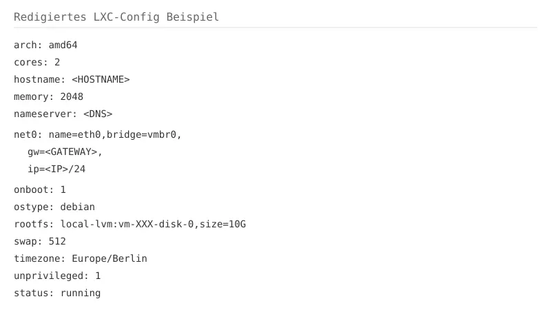
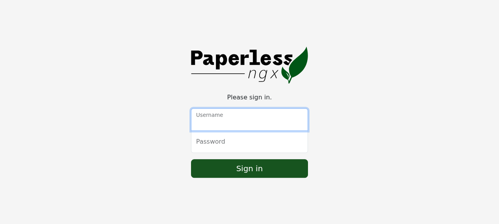

+++
title = "Paperless-ngx im Proxmox-LXC installieren: vollständige Anleitung mit OCR- und Restore-Prüfung"
description = "Paperless-ngx per Community-Script in einem Proxmox-LXC installieren, sicher einrichten und mit synthetischem OCR-, Such-, Backup- und Restore-Test prüfen."
date = 2026-10-01
draft = true
robotsNoIndex = true
noindex = true
preview = true
draft_banner = true
hideMeta = true
ShowShareButtons = false
ShowPostNavLinks = false
comments = false
tags = ["paperless-ngx", "proxmox", "lxc", "homelab", "ocr", "backup"]
categories = ["Homelab", "Virtualisierung"]

[sitemap]
  exclude = true
+++

Paperless-ngx im Proxmox-LXC installieren: vom leeren Container bis zum eigenen Funktionstest

Kurzantwort: Mit dem Paperless-ngx-Script der Proxmox Community Scripts kannst du einen Debian-LXC mit PostgreSQL, Redis, Tesseract und Paperless-ngx aufbauen. Die Installation allein reicht aber nicht. Vor dem ersten echten Dokument solltest du vier Dinge selbst nachweisen: Die Dienste laufen, ein bildbasiertes Test-PDF wird per OCR gelesen, der erkannte Begriff ist nach der Anmeldung auffindbar und ein Backup lässt sich in einem getrennten Test-LXC wiederherstellen.

Dieser Artikel führt dich durch genau diesen Ablauf. Jeder technische Schritt ist mit seinem Ausführungsort markiert:

- `[PROXMOX-HOST]`: Shell des Proxmox-VE-Hosts
- `[LXC-CONSOLE]`: Shell im Paperless-Container
- `[BROWSER]`: Paperless-Weboberfläche oder Proxmox-Weboberfläche

Transparenz: Eine bestehende Paperless-ngx-Instanz wurde am 1. Oktober 2026 read-only geprüft. Dabei waren Paperless-ngx 3.1.3, vier aktive Paperless-Dienste und die Weiterleitung zur aktuellen Anmeldeseite belegt. Die Aufnahme der Weboberfläche zeigt nur leere Anmeldefelder. Ein authentifizierter Dashboard-Zugriff, Import, OCR-Verarbeitung, Suche, instanzspezifisches Backup und Restore wurden bei dieser Prüfung nicht getestet. Auch die Installation über das Community-Script ist damit nicht als Labortest belegt. Ein früherer synthetischer Import-/OCR-Nachweis stammt aus einem getrennten Test mit abweichendem Installationsweg. Die Abschnitte 3 bis 7 sowie die Backup- und Restore-Schritte sind deshalb Anleitung zum eigenen Nachbau, kein behaupteter aktueller Ende-zu-Ende-Test.

## 1. Ergebnisbild: Was am Ende funktionieren soll

Nach dieser Anleitung hast du:

1. einen unprivilegierten Debian-LXC für Paperless-ngx,
2. eine erreichbare Weboberfläche auf Port 8000,
3. ein geändertes Administratorpasswort und ein normales Alltagskonto,
4. Deutsch als installierte und konfigurierte OCR-Sprache,
5. ein bildbasiertes synthetisches PDF ohne persönliche Daten,
6. einen dokumentierten OCR- und Suchtest,
7. einen Document-Exporter-Export, einen PostgreSQL-Dump und ein Proxmox-LXC-Backup,
8. einen getrennten Restore-Test mit klaren Erfolgskriterien.

Wichtig: Die Community Scripts sind ein eigenständiges Community-Projekt und nicht Bestandteil von Proxmox Server Solutions oder Paperless-ngx. Lies ein Root-Script, bevor du es ausführst, und dokumentiere die verwendete Quelle.

## 2. Variablenblock und Voraussetzungen

### 2.1 Eigene Werte festlegen

Kopiere den Block zuerst in eine Notiz. Ersetze jeden Wert in spitzen Klammern durch einen Wert aus deinem Netz. Die Beispielwerte sind absichtlich keine internen Laborwerte.

`[PROXMOX-HOST]` Führe den vollständig ersetzten Block anschließend in der Host-Shell aus, in der du die späteren `pct`-, `vzdump`- und Restore-Befehle verwendest. Dadurch sind unter anderem `CT_ID`, `BACKUP_STORAGE`, `RESTORE_CT_ID` und `RESTORE_STORAGE` gesetzt. Öffnest du eine neue Host-Shell, führe den Block dort erneut aus, bevor du einen Befehl mit `$VARIABLE` startest.

```bash
CT_ID="<FREIE-CT-ID>"
HOSTNAME="<PAPERLESS-HOSTNAME>"
LXC_IP_CIDR="<LXC-IP/CIDR>"
LXC_IP="<LXC-IP-OHNE-CIDR>"
GATEWAY="<GATEWAY-IP>"
DNS="<DNS-SERVER-IP>"
PAPERLESS_USER="<ALLTAGSBENUTZER>"
TESTBEGRIFF="NORDSTERN7419"
BACKUP_STORAGE="<PROXMOX-BACKUP-STORAGE>"
RESTORE_CT_ID="<FREIE-TEST-CT-ID>"
RESTORE_STORAGE="<PROXMOX-ZIEL-STORAGE>"
```

Beispiel für die Schreibweise, nicht zum blinden Übernehmen: Eine IPv4-Adresse mit Präfix sieht wie `192.0.2.40/24` aus. Dieser Dokumentationsbereich ist nicht für dein Heimnetz nutzbar; Gateway und DNS müssen zu deinem eigenen Netz passen.

Erfolgskriterium: Für alle Variablen des Blocks ist ein konkreter eigener Wert notiert und in der aktuellen Host-Shell gesetzt. `CT_ID` und `RESTORE_CT_ID` sind unterschiedlich.

Wenn etwas unklar ist: Stoppe hier. Eine geratene IP-Adresse oder ein geratenes Gateway führt später zu schwer unterscheidbaren Netzwerkfehlern.

### 2.2 Technische Voraussetzungen

Du brauchst:

- einen Proxmox-VE-Host mit Root-Shell und funktionierender Internetverbindung,
- eine freie numerische CT-ID,
- ein Storage für den Container und ein separates Ziel für Backups,
- eine freie IP-Adresse oder funktionierendes DHCP,
- korrekte Gateway- und DNS-Werte,
- einen Browser im selben erreichbaren Netz,
- ausreichend freien Speicher für Dokumente, OCR-Zwischendaten und Backups.

Stand 28. September 2026 nennt das Repository der Community Scripts Proxmox VE 8.4 sowie 9.0 bis 9.2 als unterstützte Versionen. Prüfe die Projektseite erneut, wenn du diese Anleitung später liest. [1]

Die aktuellen Standardwerte des Paperless-ngx-Scripts sind Debian 13, 2 CPU-Kerne, 3072 MiB RAM und 12 GiB Root-Disk. Das sind Script-Defaults, keine allgemeingültigen Mindestanforderungen. [2][3]

Praxiswert für einen kleinen Testaufbau: Starte mit den Script-Defaults. Plane für einen produktiven Bestand mehr Disk ein, weil Originale, Archivversionen, Vorschaubilder, Suchdaten, Datenbank und temporäre OCR-Dateien Platz benötigen. Wie viel du wirklich brauchst, hängt von Dokumentenzahl, Auflösung und Aufbewahrung ab.

`[PROXMOX-HOST]` Freie CT-ID und Storage prüfen:

```bash
pct list
pvesm status
```

Erfolgskriterium: Deine gewählte `CT_ID` erscheint nicht in `pct list`. Das Container-Storage ist `active`. Das Backup-Ziel ist ebenfalls `active` und unterstützt den Inhaltstyp `backup`.

Diagnose:

- CT-ID belegt: andere freie ID wählen.
- Storage nicht `active`: Storage-Verbindung zuerst reparieren.
- Kein Backup-Ziel: vor produktiven Daten ein geeignetes Ziel einrichten. Ein Backup ausschließlich auf derselben Disk schützt nicht vor deren Ausfall.

`[PROXMOX-HOST]` Version und Namensauflösung prüfen:

```bash
pveversion
getent hosts raw.githubusercontent.com
```

Erfolgskriterium: `pveversion` liefert eine Version. `getent` liefert mindestens eine Adresse.

Diagnose: Scheitert die Namensauflösung, prüfe die DNS-Konfiguration des Proxmox-Hosts, bevor du das Script startest.

## 3. LXC mit dem Community-Script anlegen

### 3.1 Quelle herunterladen und vor dem Start prüfen

Führe ein fremdes Root-Script nicht direkt aus einer Pipe aus. Lade es zuerst als Datei herunter.

`[PROXMOX-HOST]`

```bash
curl -fsSL \
  https://raw.githubusercontent.com/community-scripts/ProxmoxVE/main/ct/paperless-ngx.sh \
  -o /root/paperless-ngx.sh

less /root/paperless-ngx.sh
sha256sum /root/paperless-ngx.sh
```

Prüfe mindestens:

- Die URL zeigt auf `community-scripts/ProxmoxVE`.
- Im Kopf stehen Paperless-ngx, das Projekt-Repository und die Lizenz.
- Die Datei ist kein HTML-Fehlertext.
- Du notierst Datum, URL und SHA-256-Hash in deiner Betriebsdokumentation.

Der selbst berechnete Hash beweist keine Echtheit. Er hilft dir aber später festzustellen, ob du noch dieselbe Script-Datei untersuchst.

Erfolgskriterium: `curl` endet ohne Fehler, `less` zeigt ein Shell-Script und `sha256sum` gibt einen Hash aus.

Diagnose: Bei HTTP-, TLS- oder DNS-Fehlern nicht mit unsicheren Optionen wie `-k` weiterarbeiten. Netzwerk, Systemzeit und DNS des Hosts korrigieren.

### 3.2 Script starten und Dialogwerte setzen

`[PROXMOX-HOST]`

```bash
bash /root/paperless-ngx.sh
```

Wähle den erweiterten Installationsmodus, wenn du CT-ID, Hostname, Storage und Netzwerte selbst festlegen möchtest. Übernimm aus deinem Variablenblock:

- CT-ID: `${CT_ID}`
- Hostname: `${HOSTNAME}`
- IP/CIDR: `${LXC_IP_CIDR}` oder DHCP, falls dein Netz das bewusst vorsieht
- Gateway: `${GATEWAY}`
- DNS: `${DNS}`
- Bridge und optional VLAN: passend zu deinem Proxmox-Netz
- Container-Storage: dein vorgesehenes Storage

Für einen ersten Test kannst du die aktuellen Ressourcen-Defaults 2 CPU, 3072 MiB RAM und 12 GiB Disk übernehmen. Vergrößere die Disk vor produktiver Nutzung passend zu deinem Bestand. Das Script setzt standardmäßig Debian 13 und einen unprivilegierten Container ein. [2][3]

Das Script installiert in der derzeitigen Fassung unter anderem PostgreSQL, Redis, Tesseract, ImageMagick, Poppler und Paperless-ngx. Es legt die Datenbank `paperlessdb`, den Datenbankbenutzer `paperless`, vier Paperless-Systemdienste und die Verzeichnisse unter `/opt/paperless_data` an. [3]

Erfolgskriterium: Das Script endet ohne Fehlermeldung, der LXC existiert und läuft.

`[PROXMOX-HOST]`

```bash
pct status "$CT_ID"
pct config "$CT_ID"
```

Erwartet: `status: running`. In der Konfiguration stehen dein Hostname, deine Netzwerkwerte und die gewählten Ressourcen.



*Redigiertes Konfigurationsbeispiel aus der früheren Laborevidenz. Hostname, DNS, IP und Gateway sind Platzhalter; das Bild ist kein Beleg für die jeweils aktuellen Script-Defaults.*

Diagnose:

- Download bricht ab: DNS und Internetzugriff des Hosts prüfen.
- Template oder Storage fehlt: Storage-Inhaltstypen und freien Platz prüfen.
- IP-Konflikt: Container stoppen, Netzkonfiguration korrigieren und erst dann erneut starten.
- Script meldet einen Fehler: die letzte Fehlermeldung sichern; nicht wiederholt blind neu starten.

### 3.3 Zugangsdaten sicher lesen

Die aktuelle Script-Fassung schreibt den initialen WebUI-Benutzer und das generierte Passwort in `~/paperless-ngx.creds` im LXC. Das Konto heißt beim aktuellen Script `admin`. Die Datei enthält außerdem einen Secret Key und darf nicht in Screenshots, Tickets oder Chat-Nachrichten landen. [2][3]

`[PROXMOX-HOST]` LXC-Konsole öffnen:

```bash
pct enter "$CT_ID"
```

`[LXC-CONSOLE]` Rechte prüfen und Datei nur lokal anzeigen:

```bash
stat -c '%A %U:%G %n' ~/paperless-ngx.creds
cat ~/paperless-ngx.creds
```

Übertrage Benutzername und Passwort direkt in deinen Passwortmanager. Drucke die Ausgabe nicht ab und kopiere sie nicht in eine öffentlich synchronisierte Notiz.

Erfolgskriterium: Die Datei ist lesbar und enthält einen WebUI-Benutzernamen sowie ein Passwort. Im Artikel oder in deiner öffentlichen Dokumentation erscheint keiner dieser Werte.

Diagnose: Fehlt die Datei, prüfe zuerst, ob du wirklich als `root` im richtigen LXC angemeldet bist. Danach Script-Ausgabe und Installationsprotokoll prüfen, statt ein Passwort zu erraten.

## 4. Installation prüfen und WebUI öffnen

Aktueller Evidenzstand: Bei der read-only-Prüfung am 1. Oktober 2026 waren die vier Paperless-Dienste aktiv und die lokale Webroute leitete zur Anmeldung weiter. Die folgenden Prüfungen bleiben trotzdem Schritte für deine eigene Instanz; PostgreSQL, Redis und der Zugriff aus deinem Netz müssen dort separat geprüft werden.

### 4.1 Dienste in einem Befehl prüfen

`[PROXMOX-HOST]`

```bash
pct exec "$CT_ID" -- systemctl is-active \
  paperless-webserver \
  paperless-task-queue \
  paperless-consumer \
  paperless-scheduler \
  postgresql \
  redis-server
```

Erwartet: für jeden Dienst eine Zeile `active`. Die vier Paperless-Dienstnamen stammen direkt aus der aktuellen Script-Fassung. [3]

Bei einer Abweichung:

`[PROXMOX-HOST]`

```bash
pct exec "$CT_ID" -- systemctl --failed
pct exec "$CT_ID" -- journalctl -u paperless-webserver -n 80 --no-pager
pct exec "$CT_ID" -- journalctl -u paperless-consumer -n 80 --no-pager
```

Nächste sichere Aktion: Behebe die erste konkrete Fehlermeldung. Starte nicht wahllos alle Dienste neu.

### 4.2 Port und IP prüfen

`[PROXMOX-HOST]`

```bash
pct exec "$CT_ID" -- ip -4 -brief address show dev eth0
pct exec "$CT_ID" -- ss -ltnp | grep ':8000'
```

Erfolgskriterium: `eth0` zeigt die erwartete LXC-IP. Ein Prozess lauscht auf TCP-Port 8000. Das Script-Profil nennt Port 8000 als WebUI-Port. [2]

### 4.3 Weboberfläche öffnen

`[BROWSER]`

Öffne:

```text
http://<LXC-IP>:8000
```

Ersetze `<LXC-IP>` durch den Wert aus `LXC_IP`, zum Beispiel nicht durch die CIDR-Schreibweise mit `/24`.

Erfolgskriterium: Die Paperless-ngx-Anmeldeseite erscheint.



*Aktuelle Login-Seite ohne eingegebene Zugangsdaten. Die Aufnahme belegt weder einen erfolgreichen Login noch Dashboard-Zugriff, Import oder OCR.*

Diagnose:

- Zeitüberschreitung: IP, VLAN, Bridge, Firewall und Route prüfen.
- Verbindung abgelehnt: `paperless-webserver` und Port 8000 prüfen.
- Seite nur vom Host erreichbar: Client-VLAN und Firewall-Regeln prüfen.
- Zertifikatswarnung: Du hast vermutlich HTTPS aufgerufen, obwohl die lokale Standardroute HTTP nutzt.

Unverschlüsseltes HTTP gehört nur in ein vertrauenswürdiges lokales Netz. Für externen Zugriff brauchst du einen sauber konfigurierten Reverse Proxy mit TLS und eine passende `PAPERLESS_URL`. Öffne Port 8000 nicht direkt zum Internet.

## 5. Erstkonto, Sprache und Grundkonfiguration

Status dieses Abschnitts: Anleitung zum eigenen Nachbau. Die aktuelle Aufnahme endet an der Anmeldeseite; ein erfolgreicher Login und das Dashboard wurden nicht geprüft.

### 5.1 Erstanmeldung und Passwortwechsel

`[BROWSER]`

1. Melde dich mit dem WebUI-Benutzer und Passwort aus `~/paperless-ngx.creds` an.
2. Prüfe, ob du das Dashboard siehst.
3. Melde dich wieder ab, wenn du das Passwort lieber kontrolliert in der Konsole änderst.

Die folgende CLI-Methode zeigt kein Passwort in der Shell-Historie an.

`[LXC-CONSOLE]`

```bash
cd /opt/paperless/src
uv run --no-sync -- python manage.py changepassword admin
```

Gib das neue Passwort zweimal interaktiv ein. Verwende den Benutzernamen aus der Cred-Datei, falls eine spätere Script-Version nicht `admin` nutzt.

`[BROWSER]` Melde dich mit dem neuen Passwort an.

Erfolgskriterium: Das neue Passwort funktioniert. Das alte Passwort funktioniert nicht mehr.

Diagnose: Meldet `changepassword`, dass der Benutzer nicht existiert, lies ausschließlich die Zeile `Paperless-ngx WebUI User` aus der Cred-Datei erneut und verwende exakt diesen Namen.

### 5.2 Normales Alltagskonto anlegen

`[BROWSER]`

1. Öffne `Einstellungen`.
2. Öffne `Benutzer & Gruppen`.
3. Lege den Benutzer aus `PAPERLESS_USER` an.
4. Vergib nur die Berechtigungen, die für Upload, Lesen, Bearbeiten und Suche benötigt werden.
5. Teste die Anmeldung in einem privaten Browserfenster.

Paperless-ngx weist neue Benutzer standardmäßig nicht automatisch mit umfangreichen Rechten aus; Gruppen und Berechtigungen müssen bewusst gesetzt werden. [6]

Erfolgskriterium: Der Alltagsbenutzer kann ein Testdokument hochladen und wiederfinden, aber keine unnötigen Administrationsfunktionen ausführen.

### 5.3 Zeitzone und deutsche OCR konfigurieren

Das aktuelle Community-Script installiert standardmäßig nur das englische Tesseract-Sprachpaket. Für Deutsch muss das Paket ergänzt werden. [2][3]

`[LXC-CONSOLE]`

```bash
apt-get update
apt-get install -y tesseract-ocr-deu
tesseract --list-langs | grep -x 'deu'
```

Erfolgskriterium: Die letzte Zeile lautet `deu`.

Bearbeite anschließend die Konfigurationsdatei:

`[LXC-CONSOLE]`

```bash
nano /opt/paperless/paperless.conf
```

Ergänze oder ändere genau diese Zeilen:

```text
PAPERLESS_TIME_ZONE=Europe/Berlin
PAPERLESS_OCR_LANGUAGE=deu
```

Paperless-ngx dokumentiert `PAPERLESS_TIME_ZONE` und einen dreistelligen Tesseract-Code für `PAPERLESS_OCR_LANGUAGE`; `deu+eng` ist möglich, benötigt aber mehr CPU-Zeit. [5][7]

Achtung: Bestimmte OCR-Einstellungen lassen sich auch in der Weboberfläche speichern. Ein dort gesetzter Wert hat Vorrang vor der Umgebungsvariable aus `paperless.conf`. Prüfe deshalb zusätzlich die OCR-Einstellung in der Weboberfläche und stelle sicher, dass dort entweder kein abweichender Wert gespeichert oder ausdrücklich `deu` ausgewählt ist. [7]

`[LXC-CONSOLE]`

```bash
systemctl restart \
  paperless-webserver \
  paperless-task-queue \
  paperless-consumer \
  paperless-scheduler

systemctl is-active \
  paperless-webserver \
  paperless-task-queue \
  paperless-consumer \
  paperless-scheduler

grep -E '^(PAPERLESS_TIME_ZONE|PAPERLESS_OCR_LANGUAGE)=' \
  /opt/paperless/paperless.conf
```

Erfolgskriterium: Alle vier Dienste sind `active`; die Ausgabe zeigt `Europe/Berlin` und `deu`. Falls in der Weboberfläche eine OCR-Sprache gesetzt ist, lautet auch dieser vorrangige Wert `deu`.

Hinweis zur Oberflächensprache: Stelle sie im Benutzerprofil um, wenn deine installierte Paperless-Version dort eine Sprachauswahl anbietet. Andernfalls richtet sich die Darstellung nach Browser- und Frontend-Lokalisierung. Verwechsle die Oberflächensprache nicht mit `PAPERLESS_OCR_LANGUAGE`.

## 6. Synthetisches Dokument erstellen, importieren und OCR verifizieren

Dieser Test verwendet ein bildbasiertes PDF. Der Suchbegriff ist nur als Pixel im Dokument enthalten. Damit prüfst du OCR und nicht bloß die Textschicht eines digital erzeugten PDFs.

Status dieses Abschnitts: reproduzierbare Anleitung. Import, OCR-Verarbeitung und die Prüfung des erkannten Inhalts wurden in der aktuellen read-only-Evidenz nicht ausgeführt. Nimm den Ablauf in deiner Instanz selbst ab.

### 6.1 Testbegriff setzen

`[LXC-CONSOLE]`

```bash
TESTBEGRIFF="NORDSTERN7419"
```

Verwende im ersten Durchlauf genau diesen Begriff. Großbuchstaben und Ziffern sind für eine Sichtprüfung eindeutig.

Führe die Schritte 6.1 bis 6.3 in derselben LXC-Konsolensitzung aus. Öffnest du zwischendurch eine neue Sitzung, setze `TESTBEGRIFF="NORDSTERN7419"` dort erneut, bevor du die folgenden Blöcke ausführst.

### 6.2 Bild und bildbasiertes PDF erzeugen

Das Community-Script installiert ImageMagick, Liberation Fonts, Poppler und Ghostscript. [3]

`[LXC-CONSOLE]`

```bash
convert \
  -size 1654x2339 \
  xc:white \
  -fill black \
  -font Liberation-Sans \
  -pointsize 72 \
  -gravity center \
  -annotate 0 "Paperless OCR Test\n\nSuchbegriff: ${TESTBEGRIFF}\n\nKeine echten Personendaten" \
  /tmp/paperless-ocr-test.png

convert /tmp/paperless-ocr-test.png /tmp/paperless-ocr-test.pdf

file /tmp/paperless-ocr-test.pdf
pdfinfo /tmp/paperless-ocr-test.pdf | grep -E '^(Pages|Page size)'
```

Erfolgskriterium: `file` erkennt eine PDF-Datei, `pdfinfo` meldet eine Seite.

Diagnose:

- `convert: command not found`: Prüfe mit `dpkg -l imagemagick`, ob die Installation vollständig ist.
- Schrift nicht gefunden: `fc-list | grep -i liberation` ausführen und einen vorhandenen Fontnamen einsetzen.
- PDF durch ImageMagick-Richtlinie gesperrt: Prüfe `/etc/ImageMagick-6/policy.xml` beziehungsweise `/etc/ImageMagick-7/policy.xml`. Die aktuelle Script-Fassung setzt PDF auf `read|write`; bei abweichender Installation nicht blind Sicherheitsrichtlinien lockern. [3]

### 6.3 Sicherstellen, dass keine nutzbare Textschicht vorhanden ist

`[LXC-CONSOLE]`

```bash
: "${TESTBEGRIFF:?TESTBEGRIFF ist nicht gesetzt; Schritt 6.1 erneut ausführen}"

if pdftotext /tmp/paperless-ocr-test.pdf - | grep -Fq "$TESTBEGRIFF"; then
  echo "STOP: Testbegriff ist bereits als PDF-Text enthalten"
else
  echo "OK: Testbegriff liegt nur im Bild vor"
fi
```

Erfolgskriterium: `OK: Testbegriff liegt nur im Bild vor`.

Wenn `STOP` erscheint, ist der Test kein sauberer OCR-Nachweis. Erzeuge das PDF erneut aus einer Rastergrafik.

### 6.4 Dokument über das Consume-Verzeichnis einspielen

`[LXC-CONSOLE]`

```bash
install -m 0644 \
  /tmp/paperless-ocr-test.pdf \
  /opt/paperless_data/consume/paperless-ocr-test.pdf

ls -l /opt/paperless_data/consume/paperless-ocr-test.pdf
```

Paperless überwacht das Consume-Verzeichnis, verarbeitet neue Dateien und entfernt erfolgreich übernommene Dateien dort wieder. Das Original wird innerhalb der Paperless-Dateistruktur gespeichert. [6]

Warte kurz und prüfe:

`[LXC-CONSOLE]`

```bash
journalctl -u paperless-consumer -n 120 --no-pager
find /opt/paperless_data/consume -maxdepth 1 -type f -printf '%f\n'
```

Erfolgskriterium: Das Journal meldet eine erfolgreiche Verarbeitung. `paperless-ocr-test.pdf` liegt nicht mehr im Consume-Verzeichnis.

Achtung: Das Verschwinden allein ist noch kein vollständiger Erfolg. Prüfe das Dokument zusätzlich in der Weboberfläche.

### 6.5 Extrahierten Text prüfen

`[BROWSER]`

1. Öffne die Dokumentenliste.
2. Öffne das neu hinzugefügte Testdokument.
3. Öffne die Ansicht für Inhalt beziehungsweise erkannten Text.
4. Suche dort nach `NORDSTERN7419`.

Erfolgskriterium: Der erkannte Inhalt enthält `NORDSTERN7419` exakt. Das Dokument lässt sich als Vorschau öffnen.

Wenn einzelne Zeichen falsch sind:

- Prüfe, ob `deu` installiert und konfiguriert ist.
- Prüfe Consumer- und Task-Queue-Journal.
- Erzeuge den Test erneut mit größerer Schrift und höherem Kontrast.
- Verwende nicht sofort echte Dokumente, um den Fehler zu „umgehen“.

## 7. Authentifizierte Suche testen

Status dieses Abschnitts: nachzubauende Anleitung, kein behaupteter abgeschlossener Labornachweis.

`[BROWSER]`

1. Melde dich mit dem normalen Benutzer aus `PAPERLESS_USER` an.
2. Öffne die Dokumentenliste.
3. Trage exakt `NORDSTERN7419` in das Suchfeld ein.
4. Starte die Suche.
5. Öffne den Treffer und vergleiche den erkannten Inhalt.

Erfolgskriterium:

- Genau das synthetische Testdokument erscheint als Treffer.
- Der Treffer ist für den normalen Benutzer sichtbar.
- Im Dokumentinhalt steht `NORDSTERN7419`.
- Eine Suche nach einem absichtlich falschen Begriff, etwa `NORDSTERN0000`, liefert dieses Dokument nicht.

Grenzen: Ein einzelner Treffer beweist nur diesen kontrollierten Test. Er beweist nicht, dass jede Schriftart, Handschrift, Scanqualität oder Sprache zuverlässig erkannt wird. Teste vor dem Produktivbetrieb mehrere synthetische Dokumente mit den später typischen Scanbedingungen.

Wenn der Superuser den Treffer sieht, der normale Benutzer aber nicht, prüfe Eigentümer, Dokumentberechtigungen, Gruppen und Workflows. Das ist kein OCR-Fehler.

## 8. Datenpfade und laufender Betrieb

Die aktuelle Script-Fassung verwendet folgende Pfade: [2][3]

- Konfiguration: `/opt/paperless/paperless.conf`
- Programm: `/opt/paperless`
- Consume: `/opt/paperless_data/consume`
- Zustands- und Suchdaten: `/opt/paperless_data/data`
- Dokumente und Vorschaudateien: `/opt/paperless_data/media`
- Papierkorb: `/opt/paperless_data/trash`
- initiale Zugangsdaten: `/root/paperless-ngx.creds`
- PostgreSQL-Datenbank: `paperlessdb`

`[LXC-CONSOLE]` Belegung und Berechtigungen prüfen:

```bash
df -h /
du -sh /opt/paperless_data/*
stat -c '%A %U:%G %n' /opt/paperless_data/{consume,data,media,trash}
```

Erfolgskriterium: Genügend freier Platz ist vorhanden. Die Verzeichnisse existieren. Die Paperless-Dienste können darin schreiben.

Vor Updates:

1. installierte Paperless-Version notieren,
2. Release- und Migrationshinweise lesen,
3. Document Exporter ausführen,
4. Proxmox-Backup erstellen,
5. Restore-Pfad nach einer wesentlichen Änderung erneut testen.

`[LXC-CONSOLE]` Version notieren:

```bash
cd /opt/paperless
uv run --no-sync -- python -c \
  'from paperless.version import __full_version_str__; print(__full_version_str__)'
```

## 9. Document Exporter, PostgreSQL- und Proxmox-Backup

Aktueller Evidenzstand: Ein Backup-Storage war bei der read-only-Prüfung aktiv. Ein fertiges instanzspezifisches Backup wurde dabei nicht belegt. Die folgenden Schritte sind deshalb Anleitung und müssen mit einem realen Archiv sowie anschließendem Restore-Test abgeschlossen werden.

Drei Sicherungen erfüllen unterschiedliche Aufgaben:

- Document Exporter: portable Paperless-Sicherung mit Dokumenten, Vorschaubildern, Metadaten und Datenbankinhalt.
- PostgreSQL-Dump: zusätzliche Datenbanksicherung für eine kontrollierte Datenbankwiederherstellung.
- Proxmox-Backup: Sicherung des gesamten LXC einschließlich Betriebssystem und Konfiguration, soweit die Daten auf gesicherten Storage-Volumes liegen.

Keines dieser Backups ist bewiesen, bevor du es erfolgreich wiederhergestellt hast.

### 9.1 Document Exporter

Paperless empfiehlt, während eines Backups keine Dokumente zu konsumieren. Export und Import sollten versionsgleich erfolgen. API-Tokens sind nicht im Export enthalten und müssen nach einem Import neu erzeugt werden. [4]

`[LXC-CONSOLE]` Consumer kurz anhalten und Ziel anlegen:

```bash
systemctl stop paperless-consumer

EXPORT_DIR="/var/backups/paperless-ngx/export-$(date +%F)"
install -d -m 0700 "$EXPORT_DIR"

cd /opt/paperless/src
uv run --no-sync -- python manage.py document_exporter \
  "$EXPORT_DIR" \
  --no-progress-bar
```

`[LXC-CONSOLE]` Export prüfen und Consumer wieder starten:

```bash
test -s "$EXPORT_DIR/manifest.json" && echo "Manifest vorhanden"
find "$EXPORT_DIR" -maxdepth 2 -type f -printf '%s %p\n' | sort -n

du -sh "$EXPORT_DIR"
systemctl start paperless-consumer
systemctl is-active paperless-consumer
```

Erfolgskriterium: `manifest.json` ist vorhanden und nicht leer. Der Export enthält Dateien. Der Consumer ist danach wieder `active`.

Diagnose:

- `ModuleNotFoundError`: Befehl wirklich aus `/opt/paperless/src` mit `uv run` starten.
- `Permission denied`: Zielverzeichnis und freien Speicher prüfen.
- Abbruch während aktiver Verarbeitung: Consumer stoppen und erneut in ein leeres Ziel exportieren.

Kopiere den Export anschließend auf ein getrenntes Backup-Ziel. Eine Datei unter `/var/backups` im selben LXC ist nur eine Zwischenablage.

### 9.2 PostgreSQL-Dump

Die Script-Fassung vom 28. September 2026 nutzt PostgreSQL und die Datenbank `paperlessdb`. [3]

`[LXC-CONSOLE]`

```bash
DB_BACKUP_DIR="/var/backups/paperless-ngx/postgresql"
DB_DUMP="$DB_BACKUP_DIR/paperlessdb-$(date +%F).dump"

install -d -o postgres -g postgres -m 0700 "$DB_BACKUP_DIR"
runuser -u postgres -- pg_dump \
  --format=custom \
  --file="$DB_DUMP" \
  paperlessdb

chown root:root "$DB_DUMP"
chmod 0600 "$DB_DUMP"
test -s "$DB_DUMP" && echo "PostgreSQL-Dump vorhanden"
pg_restore --list "$DB_DUMP" >/dev/null && echo "Archiv lesbar"
ls -lh "$DB_DUMP"
```

Das Custom-Format ist für `pg_restore` vorgesehen. Ein lesbares Inhaltsverzeichnis beweist, dass ein Archiv erzeugt wurde; es ersetzt keinen Restore-Test. [8][9]

Erfolgskriterium: Die Dump-Datei ist größer als null Byte und `pg_restore --list` endet ohne Fehler.

Wichtig: Ein Datenbank-Dump allein enthält nicht deine Dateien unter `/opt/paperless_data/media`. Sichere Datenbank, Medien, Datenpfade und Konfiguration konsistent. Für Einsteiger ist der Document Exporter normalerweise der nachvollziehbarere logische Restore-Pfad.

### 9.3 Proxmox-LXC-Backup

Prüfe vorher, ob zusätzliche Mountpoints oder Bind-Mounts existieren:

`[PROXMOX-HOST]`

```bash
pct config "$CT_ID" | grep -E '^(rootfs|mp[0-9]+):'
```

Proxmox sichert Bind- und Device-Mounts nicht als Dateninhalt im normalen LXC-Backup; bei solchen Mounts brauchst du eine zusätzliche Sicherungsstrategie. Storage-basierte Mountpoints müssen für Backups passend konfiguriert sein. [10]

`[PROXMOX-HOST]`

```bash
vzdump "$CT_ID" \
  --storage "$BACKUP_STORAGE" \
  --mode snapshot \
  --compress zstd
```

Wenn dein Storage keine Snapshot-Sicherung unterstützt, wähle einen von Proxmox unterstützten Modus und akzeptiere die entsprechende Unterbrechung. Erfinde nicht durch Optionen eine vermeintliche Konsistenz.

`[PROXMOX-HOST]` erzeugtes Archiv prüfen:

```bash
pvesm list "$BACKUP_STORAGE" --content backup \
  | grep "vzdump-lxc-${CT_ID}-"
```

Erfolgskriterium: Der `vzdump`-Lauf endet erfolgreich und `pvesm list` zeigt ein aktuelles Backup für die richtige CT-ID.

## 10. Restore-Test im separaten Test-LXC

Status dieses Abschnitts: nicht in der aktuellen Evidenz ausgeführt. Ein erfolgreicher Restore wird hier nicht behauptet.

Teste nie über der einzigen produktiven Instanz. Der Restore-LXC braucht eine eigene CT-ID und vor dem ersten Start eine konfliktfreie Netzkonfiguration.

### 10.1 Variante A: komplettes Proxmox-Backup wiederherstellen

Diese Variante übernimmt automatisch dieselbe Paperless-Version und alle im LXC-Backup enthaltenen Daten.

`[BROWSER – PROXMOX]`

1. Öffne das Backup-Storage.
2. Wähle das gerade erzeugte LXC-Backup.
3. Klicke auf `Restore`.
4. Setze als neue CT-ID den Wert aus `RESTORE_CT_ID`.
5. Wähle `RESTORE_STORAGE` als Ziel.
6. Lass den Test-LXC nach dem Restore zunächst ausgeschaltet.

Alternativ ist die CLI möglich. Ermittle zuerst die exakte Backup-Volume-ID aus `pvesm list`; kopiere sie unverändert.

`[PROXMOX-HOST]`

```bash
BACKUP_VOLUME_ID="<EXAKTE-VOLUME-ID-AUS-PVESM-LIST>"

pct restore "$RESTORE_CT_ID" "$BACKUP_VOLUME_ID" \
  --storage "$RESTORE_STORAGE" \
  --unique 1
```

`--unique 1` erzeugt eine neue MAC-Adresse. Eine statische IP im Gast wird dadurch nicht automatisch geändert.

`[BROWSER – PROXMOX]` Vor dem ersten Start:

1. Öffne Hardware und Netzwerk des Restore-LXC.
2. Setze eine freie Test-IP oder verbinde den LXC mit einem isolierten Testnetz.
3. Prüfe, dass keine Bind-Mounts auf produktive Schreibziele zeigen.
4. Starte erst danach den Restore-LXC.

`[PROXMOX-HOST]`

```bash
pct start "$RESTORE_CT_ID"
pct exec "$RESTORE_CT_ID" -- systemctl is-active \
  paperless-webserver paperless-task-queue paperless-consumer \
  paperless-scheduler postgresql redis-server
```

`[BROWSER]` Prüfe im Restore-LXC:

- Anmeldung mit einem dafür vorgesehenen Testkonto,
- erwartete Dokumentenzahl,
- Testdokument vorhanden,
- Inhalt enthält `NORDSTERN7419`,
- Suche nach `NORDSTERN7419` findet das Dokument,
- falscher Suchbegriff findet es nicht,
- normaler Benutzer sieht nur erlaubte Dokumente,
- Original- und Archivdatei lassen sich öffnen.

Erfolgskriterium: Alle Punkte sind grün dokumentiert. Danach Test-LXC stoppen, bis du ihn erneut brauchst.

### 10.2 Variante B: Document Exporter in eine leere Instanz importieren

Diese Variante prüft die Portabilität des Paperless-Exports. Sie ist nur sicher, wenn Quell- und Zielversion übereinstimmen und die Zielinstanz leer ist. Paperless warnt ausdrücklich vor Imports in eine nicht leere Installation. [4]

`[LXC-CONSOLE – QUELLE]`

```bash
cd /opt/paperless
uv run --no-sync -- python -c \
  'from paperless.version import __full_version_str__; print(__full_version_str__)'
```

Notiere die Ausgabe.

`[LXC-CONSOLE – ZIEL]`

```bash
cd /opt/paperless
uv run --no-sync -- python -c \
  'from paperless.version import __full_version_str__; print(__full_version_str__)'
```

Stop-Signal: Sind die Versionen verschieden oder enthält das Ziel bereits Dokumente oder Konfigurationsdaten, nicht importieren. Stelle zuerst eine versionsgleiche leere Testinstanz bereit.

Kopiere den vollständigen Export auf den Test-LXC. Prüfe nach dem Kopieren mindestens `manifest.json`, Größe und Berechtigungen.

`[LXC-CONSOLE – ZIEL]`

```bash
IMPORT_DIR="/var/backups/paperless-ngx/import-test"
test -s "$IMPORT_DIR/manifest.json" || echo "STOP: Manifest fehlt"

systemctl stop paperless-consumer
cd /opt/paperless/src
uv run --no-sync -- python manage.py document_importer \
  "$IMPORT_DIR" \
  --no-progress-bar
systemctl start paperless-consumer
```

Erfolgskriterium: Der Import endet ohne Fehler. Dokumentenzahl, `NORDSTERN7419`, Suche und Benutzerrechte stimmen mit der Quelle überein. API-Tokens werden neu erzeugt und nicht als mitgesichert vorausgesetzt. [4]

### 10.3 PostgreSQL-Dump nur als fortgeschrittene Zusatzprüfung

Ein roher Datenbank-Restore ersetzt weder Medien noch Konfiguration. Nutze ihn nur in einem isolierten, versionsgleichen Testsystem, dessen Datenbank verworfen werden darf.

Sicherer Mindestablauf:

1. Paperless-Dienste stoppen.
2. Medien und Konfiguration aus demselben Sicherungszeitpunkt bereitstellen.
3. Datenbank im Testsystem leeren oder neu erstellen.
4. Dump mit `pg_restore` einspielen.
5. Rechte und Eigentümer prüfen.
6. Dienste starten und dieselben Funktionsprüfungen durchführen.

PostgreSQL weist darauf hin, dass ein Restore Befehle aus dem Dump ausführt. Stelle nur Dumps aus einer vertrauenswürdigen Quelle wieder her. [8]

Wenn du diesen Ablauf nicht selbst sicher beherrschst, verwende für den praktischen Wiederherstellungstest Variante A und B. Bewahre den Dump trotzdem als zusätzliche Sicherung auf.

## 11. Typische Fehler mit Diagnose

| Problem | Wahrscheinliche Ursache | Prüfbefehl | Sichere nächste Aktion |
|---|---|---|---|
| WebUI nicht erreichbar | falsche IP, VLAN, Firewall oder Webserver inaktiv | `[PROXMOX-HOST] pct exec "$CT_ID" -- ip -4 -brief a` und `ss -ltnp` | Netzwerte mit `pct config` vergleichen; erste Abweichung beheben |
| DNS oder Download scheitert | Resolver oder Gateway falsch | `[LXC-CONSOLE] getent hosts github.com` und `ip route` | DNS/Gateway korrigieren; TLS-Prüfung nicht abschalten |
| Dienst nicht `active` | Konfigurations-, Datenbank- oder Rechtefehler | `systemctl --failed`; `journalctl -u <DIENST> -n 100 --no-pager` | erste konkrete Fehlermeldung bearbeiten |
| OCR läuft nicht oder erkennt falsch | Sprachpaket fehlt, falsche OCR-Sprache, schlechte Vorlage | `tesseract --list-langs`; `grep '^PAPERLESS_OCR_LANGUAGE=' /opt/paperless/paperless.conf` | `tesseract-ocr-deu` installieren, `deu` setzen, Dienste neu starten |
| Datei bleibt im Consume-Verzeichnis | Consumer inaktiv, Datei noch nicht stabil, Rechte oder nicht unterstütztes Format | `systemctl status paperless-consumer`; Consumer-Journal; `stat <DATEI>` | Dienstfehler beheben; Rechte und Dateiformat prüfen |
| Datei verschwindet, Dokument fehlt | Verarbeitung fehlgeschlagen oder Duplikat | Consumer- und Task-Queue-Journal | Fehlermeldung und Dokumentstatus prüfen; nicht wiederholt dieselbe Datei kopieren |
| Login schlägt fehl | falscher Benutzer, Passwort geändert oder Cred-Datei verwechselt | nur Benutzernamen aus `~/paperless-ngx.creds` lesen | Passwort interaktiv mit `manage.py changepassword <USER>` setzen |
| Speicherplatz knapp | Medien, OCR-Dateien, Export oder Logs wachsen | `df -h`; `du -sh /opt/paperless_data/* /var/backups/paperless-ngx/*` | Import stoppen, Kapazität erweitern, Backups aus dem LXC auslagern |
| Document Exporter scheitert | falsches Arbeitsverzeichnis, fehlendes `uv run`, Ziel nicht beschreibbar | `pwd`; `ls -ld <ZIEL>` | aus `/opt/paperless/src` mit `uv run --no-sync --` starten |
| PostgreSQL-Dump leer oder fehlerhaft | falsche Datenbank, Rechte oder voller Datenträger | `pg_restore --list <DUMP>`; `df -h` | Fehler beheben und neuen Dump erzeugen; leere Datei nicht als Backup zählen |
| Proxmox-Backup enthält nicht alle Daten | Bind-/Device-Mount oder ausgeschlossener Mountpoint | `pct config "$CT_ID" | grep -E '^(rootfs|mp[0-9]+):'` | Mounts separat sichern und Restore dieses Pfads testen |
| Restore startet mit IP-Konflikt | statische Quell-IP wurde übernommen | Restore-LXC ausgeschaltet lassen; Netzkonfiguration prüfen | eigene Test-IP oder isolierte Bridge setzen, dann starten |
| Suche findet nichts | OCR-Inhalt fehlt, Index/Task noch nicht fertig oder Benutzer hat keine Rechte | Dokumentinhalt prüfen; Task-Journal; Anmeldung als normaler Benutzer | Ursache trennen: OCR, Index oder Berechtigung einzeln prüfen |

## 12. Checkliste vor produktiven Dokumenten

Installation und Zugriff:

- [ ] Die Script-Quelle wurde vor Ausführung geprüft und ihr Hash dokumentiert.
- [ ] Eigene CT-ID, IP, Gateway, DNS, Bridge und Storage-Werte wurden verwendet.
- [ ] Alle vier Paperless-Dienste sowie PostgreSQL und Redis sind `active`.
- [ ] Port 8000 ist nur aus dem vorgesehenen Netz erreichbar.
- [ ] Das initiale Admin-Passwort wurde geändert.
- [ ] Ein normales Benutzerkonto mit begrenzten Rechten wurde getestet.

OCR und Suche:

- [ ] `tesseract --list-langs` enthält `deu`.
- [ ] Die wirksame OCR-Sprache ist `deu`; ein in der Weboberfläche gespeicherter Vorrangwert wurde geprüft.
- [ ] Das bildbasierte Test-PDF enthält vor dem Import keine nutzbare Textschicht.
- [ ] Der erkannte Dokumentinhalt enthält exakt `NORDSTERN7419`.
- [ ] Die authentifizierte Suche des normalen Benutzers findet genau das Testdokument.
- [ ] Ein falscher Kontrollbegriff findet das Dokument nicht.

Backup und Restore:

- [ ] Der Document Exporter erzeugt eine nicht leere `manifest.json` und Dokumentdateien.
- [ ] Der PostgreSQL-Dump ist nicht leer und mit `pg_restore --list` lesbar.
- [ ] Das Proxmox-Backup erscheint im vorgesehenen Backup-Storage.
- [ ] Zusätzliche Mountpoints sind erfasst und ihre Sicherungswirkung ist geklärt.
- [ ] Der Restore wurde mit eigener CT-ID und konfliktfreier Test-IP durchgeführt.
- [ ] Dokumentenzahl, OCR-Inhalt, Suche, Dateien und Rechte stimmen nach dem Restore.
- [ ] Der Exporter-Import wurde nur versionsgleich und in eine leere Instanz getestet.
- [ ] Backups liegen auch außerhalb des Paperless-LXC und möglichst außerhalb des Proxmox-Hosts.

Stop-Signal: Bleibt auch nur einer der Such-, Backup- oder Restore-Punkte ungeprüft, importiere noch keine produktiven Dokumente. Ein vorhandenes Backup-Archiv ist kein bewiesener Wiederherstellungsweg.

Baue den Ablauf zuerst mit synthetischen Daten nach, prüfe OCR und Suche selbst und teste einen Restore in einem getrennten LXC, bevor du produktive Dokumente importierst.

---

Quellen

[1] Community Scripts, Repository und Voraussetzungen: https://github.com/community-scripts/ProxmoxVE

[2] Community Scripts, Paperless-ngx-Scriptseite mit Installationsbefehl, Port, Defaults, Cred-Datei und OCR-Hinweis: https://community-scripts.org/scripts/paperless-ngx

[3] Community Scripts, aktuelle Quelltexte des Container- und Installationsscripts: https://github.com/community-scripts/ProxmoxVE/blob/main/ct/paperless-ngx.sh und https://github.com/community-scripts/ProxmoxVE/blob/main/install/paperless-ngx-install.sh

[4] Paperless-ngx, Administration: Backup, Document Exporter und Document Importer: https://docs.paperless-ngx.com/administration/

[5] Paperless-ngx, Setup: Zeitzone und OCR-Sprache: https://docs.paperless-ngx.com/setup/

[6] Paperless-ngx, Bedienung: Upload, Consume-Verzeichnis, Suche, Benutzer und Berechtigungen: https://docs.paperless-ngx.com/usage/

[7] Paperless-ngx, Konfiguration: `PAPERLESS_OCR_LANGUAGE`, OCR-Modus und Zeitzone: https://docs.paperless-ngx.com/configuration/

[8] PostgreSQL, `pg_restore`: https://www.postgresql.org/docs/current/app-pgrestore.html

[9] PostgreSQL, Backup und Restore: https://www.postgresql.org/docs/current/backup.html

[10] Proxmox VE, `pct` sowie LXC-Backup und Restore: https://pve.proxmox.com/pve-docs/pct.1.html
