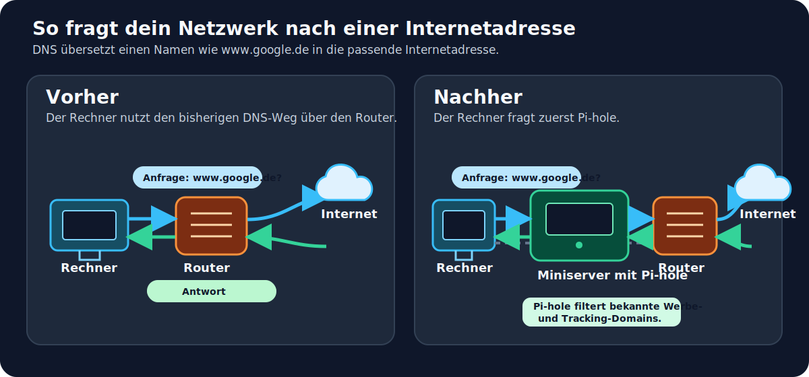

+++
title = "Pi-hole im Proxmox-Homelab: Dein erster eigener DNS-Werbeblocker"
description = "Einsteigerfreundlicher Pi-hole-Einstieg im Proxmox-LXC: Container, DNS, Blocking, Neustart und Backup verständlich prüfen."
date = 2026-07-22
draft = false
robotsNoIndex = true
noindex = true
preview = true
draft_banner = true
hideMeta = true
ShowShareButtons = false
ShowPostNavLinks = false
comments = false
tags = ["pihole", "proxmox", "dns", "lxc", "homelab"]
categories = ["Software", "Virtualisierung"]

[sitemap]
  exclude = true

# Preview Classification
preview_content_type = "article_draft"
publish_eligible = false
user_visual_approval_required = true
fact_check_required = true
link_check_required = true
price_check_required = false
recommended_action = "Eigentümer prüft und genehmigt den einsteigerfreundlich überarbeiteten Pi-hole-Artikel, die DNS-Erklärgrafik und die fünf Screenshot-Platzhalter."
content_intent = "deep_dive"
monetization_intent = "none"
affiliate_disclosure_required = false
price_research_required = false
product_recommendation_allowed = false
instagram_derivatives_required = false
risk_level = "medium"

content_state = "draft_generated"
audit_status = "technical_factcheck_completed"
user_approval_required = true
approved_for_publish = false
next_action = "owner_review_article_graphic_and_screenshot_placeholders"
+++

> [!IMPORTANT]
> **Preview – noch nicht veröffentlicht.** Dieser überarbeitete Entwurf ist nur zur visuellen und redaktionellen Prüfung bestimmt.
> - Typ: `article_draft`
> - Publish-Eligible: `false`
> - Technischer Faktencheck: abgeschlossen
> - Nächster Schritt: Eigentümerprüfung von Artikeltext, Erklärgrafik und fünf Screenshot-Platzhaltern.

---

# Pi-hole im Proxmox-Homelab: Dein erster eigener DNS-Werbeblocker

Pi-hole war mein erster Dienst auf PVE04. Das ist ein guter Einstieg ins Homelab: Du baust einen kleinen Container, lernst den DNS-Weg kennen und kannst jeden wichtigen Schritt einfach prüfen.

PVE04 ist dabei ein eigener Proxmox-Testhost, nicht mein produktives Homelab. Der Artikel zeigt deshalb einen ehrlichen Praxisweg: Was funktioniert hat, welche Probleme auftraten und was bewusst noch offen ist.

## Kurz gesagt

Pi-hole nimmt DNS-Anfragen entgegen. DNS ist das Telefonbuch des Netzes: Wenn du `www.google.de` eingibst, wird daraus die passende Internetadresse. Mit Pi-hole fragt ein Gerät zuerst diesen kleinen Dienst. Pi-hole beantwortet normale Anfragen und kann bekannte Werbe- und Tracking-Domains blockieren.

## Dein einfacher Weg durch das Projekt

1. Container anlegen
2. Netzwerk festlegen
3. Debian starten
4. Pi-hole installieren
5. Weboberfläche und DNS testen
6. Blocking testen
7. Neustart testen
8. Backup erstellen

Das ist kein Rezept, das du blind in jedem Heimnetz anwenden solltest. Es ist aber ein klarer roter Faden für einen kleinen, kontrollierten Einstieg.

## Das brauchst du

> **Für diesen Einstieg brauchst du:**
> - einen laufenden Proxmox-Host
> - eine freie feste IP-Adresse und die Gateway-IP deines Netzes
> - Grundzugriff auf die Proxmox-Oberfläche
> - für Pi-hole ungefähr 1 vCPU, 512 MiB RAM und 8 GiB Speicher

> **Das brauchst du noch nicht:**
> - VLANs
> - Unbound oder DNS-over-HTTPS
> - Pi-hole als DHCP-Server
> - eine lokale DNS-Zone
> - einen Restore-Test
>
> Diese Themen können später sinnvoll sein. Für den ersten funktionierenden Pi-hole-Container machen sie den Einstieg aber nur unnötig kompliziert.



*Ohne Pi-hole läuft die DNS-Anfrage über den bisherigen Weg. Mit Pi-hole fragt dein Gerät zuerst den kleinen DNS-Dienst; dieser filtert bekannte Werbe- und Tracking-Domains und fragt bei Bedarf weiter.*

[SCREENSHOT BENÖTIGT: Bereinigte Proxmox-Übersicht von PVE04 mit dem Pi-hole-Container; nur PVE04 und `01-pihole` zeigen, keine privaten Netzdaten oder Zugangsinformationen.]

## 1. Ausgangslage: ein kleiner Container statt einer großen Umstellung

PVE04 ist ein Fujitsu Futro S7010 mit vier CPU-Kernen, 4 GB RAM und einer 64-GB-SSD. Der Host dient ausschließlich als Content- und Test-Lab. Für Pi-hole entstand der unprivilegierte LXC-Container CT 101 mit dem Namen `01-pihole`.

| Bereich | Verwendete Konfiguration |
|---|---|
| Basis | Debian 13.6 als unprivilegierter LXC |
| CPU | 1 vCPU |
| Arbeitsspeicher | 512 MiB RAM und 512 MiB Swap |
| Root-Disk | 8 GiB auf `local-lvm` |
| Netzwerk | Bridge `vmbr0`, VLAN 20 |
| Startverhalten | Autostart aktiviert |
| Upstream-DNS | `1.1.1.1` und `1.0.0.1` |

Ein **LXC** ist ein schlanker Linux-Container. Er nutzt den Kernel des Proxmox-Hosts, bleibt aber ein eigener Gast. **Unprivilegiert** bedeutet: Der Container bekommt auf dem Host nicht automatisch weitreichende Root-Rechte.

Im Test-Lab lag CT 101 in VLAN 20. Ein **VLAN** trennt Netzbereiche logisch. Wenn du keine VLANs verwendest, ist das kein Problem: Hänge den Container einfach an deine normale Proxmox-Bridge **ohne** VLAN-Tag. Die feste IP-Adresse und das Gateway müssen dann zu deinem normalen Netz passen.

[SCREENSHOT BENÖTIGT: Bereinigte CT-101-Konfiguration mit CPU, RAM, Disk, optionalem VLAN und Autostart; IP-Adresse, Gateway, MAC-Adresse, Bridge-Details und Benutzerangaben schwärzen.]

## 2. Erst parallel aufbauen, dann in Ruhe testen

Für den Aufbau nutzte der neue Container zunächst einen vorhandenen Resolver. Pi-hole leitete später unbekannte Anfragen an die dokumentierten Upstream-DNS-Server `1.1.1.1` und `1.0.0.1` weiter.

Der wichtige Punkt für Einsteiger: Ändere nicht gleichzeitig Container, DNS-Server, DHCP, Filterlisten und Router. Baue Pi-hole zuerst parallel auf und prüfe ihn direkt. So weißt du bei einem Fehler, an welcher Stelle du suchen musst.

Der neue Pi-hole wurde parallel aufgebaut und technisch getestet. Die endgültige Umstellung des PVE04-Resolvers und die Ablösung der alten Testcontainer waren ein eigener Abschluss-Schritt und gehörten nicht zu diesem Artikel.

## 3. Debian starten und Pi-hole installieren

Für den Container kam das offizielle Debian-13-Template zum Einsatz. Den Pi-hole-Installer führte ich nicht blind als Pipeline aus dem Internet aus: Die offizielle Installerdatei wurde zuerst gespeichert und geprüft. Danach begann die interaktive Installation.

Die getesteten Versionen waren Pi-hole Core v6.4.3, Web v6.6 und FTL v6.7. FTL ist der Dienst, der die DNS-Anfragen verarbeitet und Daten für die Weboberfläche bereitstellt.

> **Erwartetes Ergebnis nach der Installation:**
> - die Installation endet ohne Abbruch
> - die Pi-hole-Weboberfläche ist erreichbar
> - der Dienst FTL läuft

[SCREENSHOT BENÖTIGT: Pi-hole-Weboberfläche nach erfolgreicher Anmeldung; neutralen Dashboard-Bereich zeigen, Query-Log, Clientnamen, Domains, IP-/MAC-Adressen und Zugangsdaten vorher bereinigen.]

### Praxisproblem: Der Installer brauchte ein richtiges Terminal

**Einordnung:** Der erste Versuch hatte kein nutzbares Terminal und blieb deshalb unvollständig. Das war kein Pi-hole-Fehler.

**Lösung:** Der gleiche, zuvor geprüfte Installer lief danach in einer passenden interaktiven Terminalumgebung erfolgreich durch.

**Warum ich so vorging:** Statt an Pi-hole-Einstellungen zu drehen, habe ich nur den Ausführungskontext korrigiert. Für dich reicht die Merkhilfe: Wenn ein Installer Eingaben erwartet, starte ihn in einer echten interaktiven Sitzung.

## 4. Kleine Fehler gezielt lösen

Nach der Installation gehörten zwei Pi-hole-Pfade zunächst `root:root`: `FTL.log` und `config_backups`. Der Pi-hole-Dienst braucht dort Schreibzugriff für Protokolle und Konfigurationssicherungen.

> **Praxisproblem:** Pi-hole kann in betroffenen Bereichen nicht sauber schreiben.
>
> **Einordnung:** Nicht der ganze Container war falsch eingerichtet, sondern nur zwei konkrete Pfade.
>
> **Lösung:** Nur diese beiden Pfade wurden auf `pihole:pihole` korrigiert. Die vorhandenen Dateimodi blieben unverändert.
>
> **Warum ich so vorging:** Ein pauschales rekursives `chown` hätte viele nicht betroffene Dateien verändert. Die kleinste passende Korrektur ist hier sicherer und leichter nachvollziehbar.

Im unprivilegierten LXC erschienen außerdem systemd-Mount-Warnungen und ein Hinweis zu `CAP_SYS_NICE`. Beide Hinweise blockierten DNS, FTL und die Weboberfläche nicht. Deshalb wurde nichts „auf Verdacht“ repariert.

> **Merksatz:** Nicht jede Warnung verlangt eine Änderung. Erst prüfen, ob die betroffene Funktion wirklich ausfällt.

## 5. DNS, Blocking und Neustart testen

Jetzt kommt der Teil, der aus einer Installation einen nutzbaren Dienst macht. Pi-hole wurde nicht nur einmal angepingt, sondern an mehreren Stellen geprüft.

| Test | Erwartetes Ergebnis | Dokumentiertes Ergebnis |
|---|---|---|
| Pi-hole FTL | Dienst läuft und startet automatisch | aktiv und aktiviert |
| Weboberfläche | Anmeldung und Admin-Seite erreichbar | erfolgreich |
| DNS über UDP und TCP | normale Domain liefert eine Antwort | erfolgreich |
| Blocking | getestete Werbedomain liefert `0.0.0.0` | erfolgreich |
| Neustart | Container und Pi-hole kommen wieder hoch | CT 101 nach 2 Sekunden wieder `running` |

DNS kann UDP und TCP verwenden. Viele Anfragen laufen über UDP; TCP bleibt für bestimmte Antworten wichtig. Deshalb wurden beide Wege getrennt geprüft.

```bash
# DNS-Abfrage über UDP an den Pi-hole-Container
dig @192.168.20.201 deb.debian.org A +time=2 +tries=1

# Dieselbe Art Abfrage über TCP
dig +tcp @192.168.20.201 deb.debian.org A +time=2 +tries=1
```

> **Erwartetes Ergebnis nach dem DNS-Test:**
> Eine normale Domain wie `example.com` oder `deb.debian.org` liefert eine IP-Adresse. Der Test darf nicht in einen Timeout laufen.

Beim Blocking wurden `ad.doubleclick.net`, `googleads.g.doubleclick.net` und `ads.youtube.com` getestet. Sie lieferten `0.0.0.0`.

> **Erwartetes Ergebnis nach dem Blocking-Test:**
> Die getestete Werbe- oder Tracking-Domain liefert `0.0.0.0`. Das zeigt die Filterfunktion für genau diese Domains – nicht die Garantie, jede Werbung im Internet zu blockieren.

[SCREENSHOT BENÖTIGT: Je einen bereinigten DNS-Test für UDP und TCP sowie einen unkritischen Blocking-Nachweis zeigen; interne IP-Adressen, Hostnamen, Resolver-/Suchdomain, Nutzername, Prompt-Pfad und Zeitstempel schwärzen.]

> **Erwartetes Ergebnis nach dem Neustart:**
> Der Container steht wieder auf `running`, Pi-hole antwortet erneut auf DNS-Anfragen und die Weboberfläche ist erreichbar.

## 6. Backup: ein Sicherungspunkt, kein Restore-Beweis

Nach Aufbau und Funktionstests wurde CT 101 als Proxmox-Snapshot mit zstd gesichert. Die bestätigte Backupdatei war 304.195.522 Bytes groß, also ungefähr 290 MiB. Der Lauf dauerte 18 Sekunden und endete erfolgreich.

> **Erwartetes Ergebnis nach dem Backup:**
> Der Task endet ohne Fehler und zeigt einen erfolgreichen Sicherungslauf mit Größe und Dauer.

[SCREENSHOT BENÖTIGT: Erfolgreichen Backup-Task mit Status, Größe und Dauer zeigen; interne Pfade, Task-IDs, Storage-Details, Host-/Benutzernamen sowie IP-/MAC-Adressen bereinigen.]

Wichtig: Ein Snapshot-Backup ist ein Sicherungspunkt des Containerzustands. Es ist noch kein getesteter Wiederherstellungsnachweis. Ein Restore-Test und ein dauerhaft geplanter täglicher Backupjob waren in diesem Projekt nicht dokumentiert.

Kurz nach Aufbau und Test lagen die dokumentierten Werte bei 20 MiB RAM-Nutzung, 0 MiB verwendetem Swap und ungefähr 874 MiB auf der Root-Disk. Das sind Momentaufnahmen, keine Langzeitmessung oder allgemeine Mindestwerte.

Beim Backup fiel außerdem eine Thin-Pool-Warnung auf. Das Backup selbst war erfolgreich. Die Warnung betrifft separat die Storage-Kapazität und wurde nicht durch Änderungen an LVM, Storage oder Auto-Extend „gelöst“.

## 7. Fazit: Pi-hole einrichten, wenn du klein anfängst

Pi-hole war für PVE04 ein sinnvoller erster Dienst. Der einfache Weg war: Container klein halten, Netzwerk festlegen, installieren, DNS und Blocking prüfen, Neustart testen und einen Sicherungspunkt erstellen.

**Pi-hole einrichten, wenn** du einen kleinen Proxmox-Host hast, eine feste Containerkonfiguration nachvollziehen kannst und Tests vor einer größeren DNS-Umstellung einplanst.

**Noch nicht einrichten, wenn** dir ein dokumentierter Rückweg für DNS-Änderungen fehlt oder der Dienst sofort ungeprüft das ganze produktive Heimnetz versorgen soll.

Als nächster Dienst auf PVE04 ist Uptime Kuma geplant. Das wäre ein passender zweiter Schritt, um die Erreichbarkeit eigener Dienste zu überwachen.

## FAQ

### Reichen 512 MiB RAM für Pi-hole im LXC?

Im dokumentierten CT 101 liefen Pi-hole, Weboberfläche, DNS-Tests und der Neustart mit 512 MiB RAM. Andere Filterlisten, Versionen oder Umgebungen können mehr benötigen.

### Brauche ich für Pi-hole ein VLAN?

Nein. Im Test-Lab kam VLAN 20 zum Einsatz. Ohne VLAN verwendest du einfach deine normale Proxmox-Bridge ohne VLAN-Tag.

### Ist ein erfolgreiches Snapshot-Backup ein getesteter Restore?

Nein. Der Sicherungslauf war erfolgreich, ein Restore-Test ist für dieses Projekt aber nicht dokumentiert.

### Warum wurden die LXC-Warnungen nicht repariert?

Weil sie keine Pi-hole-Funktion blockierten. DNS, Weboberfläche, Blocking und Neustart waren erfolgreich. Eine Änderung ohne nachgewiesenen Fehler hätte nur zusätzliche Risiken geschaffen.

## ✅ Das solltest du jetzt können

- [ ] Du weißt, was Pi-hole beim DNS-Weg macht.
- [ ] Du kannst die minimale Containergröße einordnen.
- [ ] Du weißt, dass ein VLAN für den Einstieg nicht zwingend ist.
- [ ] Du kannst eine normale DNS-Antwort von einem Blocking-Ergebnis unterscheiden.
- [ ] Du weißt, warum ein Neustarttest und ein Backup zum Aufbau dazugehören.
- [ ] Du verwechselst ein erfolgreiches Backup nicht mit einem getesteten Restore.

## Offizielle Dokumentation

- [Pi-hole: Installation](https://docs.pi-hole.net/main/basic-install/) – Der offizielle Installer kann heruntergeladen und vor der Ausführung geprüft werden.
- [Proxmox VE Administration Guide: Container Toolkit](https://pve.proxmox.com/pve-docs/pve-admin-guide.html#chapter_pct) – Grundlagen zu LXC-Containern, Einstellungen und Sicherungen.
- [Debian „trixie“ Release Information](https://www.debian.org/releases/trixie/) – Einordnung von Debian 13.6 als `trixie`.
